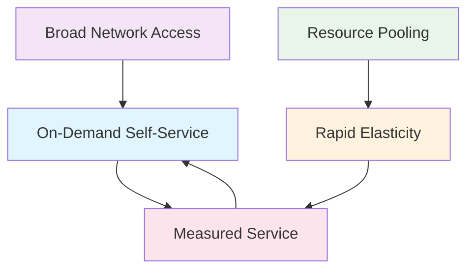

The National Institute of Standards and Technology (NIST) defines five essential characteristics that distinguish cloud computing from traditional computing models. Understanding these characteristics is crucial for recognizing true cloud services and making informed decisions about cloud adoption.

## 1. On-Demand Self-Service

### Definition
Consumers can unilaterally provision computing capabilities, such as server time and network storage, as needed automatically without requiring human interaction with each service provider.

### Key Features
- **Automated Provisioning**: Resources are allocated automatically through web interfaces or APIs
- **No Human Intervention**: Users don't need to contact support or wait for manual approval
- **Immediate Access**: Resources are available within minutes or seconds
- **User Control**: Complete control over resource allocation and deallocation

### Real-World Examples
- **Amazon EC2**: Launch virtual machines with a few clicks
- **Google Cloud Storage**: Create storage buckets instantly
- **Microsoft Azure**: Deploy applications without waiting for IT approval

### Business Impact
```
Traditional Model: Days/Weeks to provision resources
Cloud Model: Minutes/Seconds to provision resources
Result: 100x faster time-to-market
```

## 2. Broad Network Access

### Definition
Capabilities are available over the network and accessed through standard mechanisms that promote use by heterogeneous thin or thick client platforms (e.g., mobile phones, tablets, laptops, and workstations).

### Key Features
- **Internet Accessibility**: Services accessible from anywhere with internet connection
- **Device Independence**: Works across different devices and platforms
- **Standard Protocols**: Uses common internet protocols (HTTP/HTTPS, REST APIs)
- **Global Reach**: Services available worldwide

### Access Methods
- **Web Browsers**: Platform-independent access
- **Mobile Applications**: Native apps for smartphones and tablets
- **APIs**: Programmatic access for automation
- **Command Line Tools**: For developers and system administrators

### Practical Implications
```javascript
// Example: Accessing cloud storage from different platforms
// Web Browser
https://console.aws.amazon.com/s3/

// Mobile App
AWS Mobile SDK for iOS/Android

// API Call
curl -X GET https://s3.amazonaws.com/my-bucket/my-file.txt

// Command Line
aws s3 cp my-file.txt s3://my-bucket/
```

## 3. Resource Pooling

### Definition
The provider's computing resources are pooled to serve multiple consumers using a multi-tenant model, with different physical and virtual resources dynamically assigned and reassigned according to consumer demand.

### Key Concepts
- **Multi-Tenancy**: Multiple customers share the same physical infrastructure
- **Dynamic Allocation**: Resources are assigned based on current demand
- **Location Independence**: Users generally don't know the exact location of resources
- **Abstraction**: Physical infrastructure is abstracted from users

### Types of Resource Pooling
#### Compute Pooling
- Shared CPU cores across virtual machines
- Dynamic allocation based on workload demands
- Hypervisor-level resource management

#### Storage Pooling
- Distributed storage across multiple physical devices
- Data replication for reliability and performance
- Automatic load balancing

#### Network Pooling
- Shared bandwidth and network infrastructure
- Software-defined networking (SDN)
- Virtual private networks (VPNs)

### Benefits and Considerations
```
Benefits:
✓ Cost efficiency through shared resources
✓ Better resource utilization
✓ Economies of scale
✓ Improved reliability through redundancy

Considerations:
⚠ Security isolation between tenants
⚠ Performance variability (noisy neighbor effect)
⚠ Compliance and data sovereignty
⚠ Vendor lock-in concerns
```

## 4. Rapid Elasticity

### Definition
Capabilities can be elastically provisioned and released, in some cases automatically, to scale rapidly outward and inward commensurate with demand. To the consumer, the capabilities available for provisioning often appear to be unlimited.

### Types of Elasticity
#### Vertical Scaling (Scale Up/Down)
- Increasing/decreasing the power of existing resources
- Adding more CPU, RAM, or storage to a single instance
- Suitable for applications that can't be easily distributed

#### Horizontal Scaling (Scale Out/In)
- Adding/removing more instances of resources
- Distributing load across multiple servers
- Better for distributed applications and microservices

### Scaling Strategies
#### Manual Scaling
```bash
# Example: Manual scaling with AWS CLI
aws autoscaling set-desired-capacity \
    --auto-scaling-group-name my-asg \
    --desired-capacity 10
```

#### Scheduled Scaling
```yaml
# Example: Scheduled scaling configuration
scheduledActions:
  - name: "morning-scale-up"
    schedule: "0 8 * * MON-FRI"
    desiredCapacity: 10
  - name: "evening-scale-down"
    schedule: "0 18 * * MON-FRI"
    desiredCapacity: 2
```

#### Auto Scaling
```json
{
  "scalingPolicies": [
    {
      "metricType": "CPUUtilization",
      "targetValue": 70,
      "scaleUpCooldown": 300,
      "scaleDownCooldown": 300
    }
  ]
}
```

### Real-World Scenarios
- **E-commerce**: Scaling during Black Friday sales
- **Media Streaming**: Handling viral content spikes
- **Gaming**: Managing player load fluctuations
- **Financial Services**: Processing end-of-day transactions

## 5. Measured Service

### Definition
Cloud systems automatically control and optimize resource use by leveraging a metering capability at some level of abstraction appropriate to the type of service (e.g., storage, processing, bandwidth, and active user accounts).

### Key Components
#### Monitoring
- Real-time resource usage tracking
- Performance metrics collection
- Service level monitoring
- User activity analytics

#### Metering
- Granular usage measurement
- Time-based billing increments
- Resource consumption tracking
- Service quality metrics

#### Billing
- Pay-per-use pricing models
- Transparent cost allocation
- Detailed usage reports
- Cost optimization recommendations

### Pricing Models
#### Pay-As-You-Go
```
Compute: $0.10 per hour per instance
Storage: $0.023 per GB per month
Data Transfer: $0.09 per GB
API Calls: $0.0000004 per request
```

#### Reserved Instances
```
1-Year Term: 30% discount
3-Year Term: 50% discount
Upfront Payment: Additional 10% discount
```

#### Spot Pricing
```
Market-based pricing for unused capacity
Up to 90% discount from on-demand prices
Suitable for fault-tolerant workloads
```

### Benefits of Measured Service
- **Cost Transparency**: Clear understanding of resource costs
- **Usage Optimization**: Identify and eliminate waste
- **Capacity Planning**: Data-driven scaling decisions
- **Chargeback/Showback**: Internal cost allocation

## Interconnected Nature of Characteristics

These five characteristics work together to create the cloud computing experience:



## Verification Checklist

To determine if a service truly embodies cloud computing, verify:

- [ ] Can users provision resources without human intervention?
- [ ] Is the service accessible from multiple devices and locations?
- [ ] Are resources shared among multiple users efficiently?
- [ ] Can the service scale up and down based on demand?
- [ ] Is usage monitored, measured, and billed transparently?

## Conclusion

Understanding these five essential characteristics provides the foundation for evaluating cloud services and making informed decisions about cloud adoption. Each characteristic contributes to the overall value proposition of cloud computing: increased agility, reduced costs, and improved scalability.

In the next lesson, we'll explore how these characteristics manifest in different service models: Infrastructure as a Service (IaaS), Platform as a Service (PaaS), and Software as a Service (SaaS).
