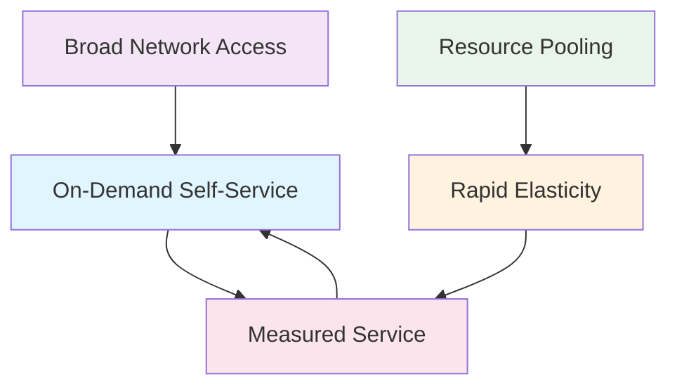

The National Institute of Standards and Technology (NIST) defines five essential characteristics that distinguish cloud computing from traditional computing models. Understanding these characteristics is crucial for recognizing true cloud services and making informed decisions about cloud adoption. These features—On-demand self-service, Broad network access, Resource pooling, Rapid elasticity, and Measured service—collectively define what we know today as the "Cloud."

## 1. On-Demand Self-Service

On-demand self-service enables consumers to unilaterally provision computing capabilities, such as server time and network storage, automatically and without requiring human interaction with the service provider. In a traditional IT environment, requesting a new server often involved a lengthy process: submitting tickets, waiting for approvals from the finance department, and scheduling manual configuration by IT staff. In the cloud model, this friction is effectively eliminated.

This characteristic empowers users to access resources immediately. Whether a developer needs a staging environment for a few hours or a data scientist requires a high-performance cluster for a complex simulation, they can obtain these resources within minutes—or even seconds—through a web-based dashboard or a programmable API. This level of automation and speed fundamentally shifts the focus from infrastructure procurement to innovation and deployment, giving users complete control over their resource lifecycle.

### Business Impact
The shift from weeks to minutes for resource provisioning dramatically accelerates time-to-market. Businesses can experiment with new ideas, "fail fast," and iterate rapidly without the penalty of long lead times or sunken costs in unused hardware.

## 2. Broad Network Access

Cloud capabilities are available over the network and accessed through standard mechanisms that promote use by heterogeneous client platforms. This means that cloud services are not bound to a specific physical location or a specialized device; they are accessible from anywhere with an internet connection, whether on mobile phones, tablets, laptops, or enterprise workstations.

By relying on standard internet protocols like HTTP, HTTPS, and REST APIs, cloud services ensure pervasive access. This ubiquity supports modern work patterns, allowing remote teams to collaborate seamlessly and providing developers with the flexibility to build applications that serve users globally, regardless of their device or underlying operating system.

### Practical Implications
This accessibility unifies the experience across different interfaces. A user might upload a file via a web browser, a mobile app might read that file, and a backend server might process it via an API call—all interacting with the same cloud storage service seamlessly over the internet.

## 3. Resource Pooling

The provider's computing resources are pooled to serve multiple consumers using a multi-tenant model, with different physical and virtual resources dynamically assigned and reassigned according to consumer demand. This concept is similar to how a utility company generates electricity for an entire city; individual customers don't own the generator, they simply draw power from the shared grid.

### Multi-Tenancy and Abstraction
Under the hood, multiple customers (tenants) may share the same physical server, storage array, or network switch, yet they remain logically isolated and secure from one another. This "multi-tenancy" allows providers to achieve significant economies of scale, optimizing equipment usage and energy consumption. For the user, the physical location of the resource is often abstract—they might specify a general region (e.g., "US East" or "Europe") for latency or compliance reasons, but they rarely know or care about the exact rack or server where their application resides.

## 4. Rapid Elasticity

Capabilities can be elastically provisioned and released, often automatically, to scale rapidly outward and inward commensurate with demand. To the consumer, the capabilities available for provisioning often appear to be unlimited and can be appropriated in any quantity at any time.

This elasticity allows systems to adapt to workload changes in real-time. For example, an e-commerce website can automatically "scale out" (add more web servers) during a Black Friday sale to handle the increased traffic surge. Conversely, once the event is over, the system can "scale in" (remove the extra servers). This dynamic adjustment ensures that performance remains consistent during traffic peaks while costs are minimized during valleys, effectively eliminating the need to over-provision hardware for "worst-case" scenarios.

## 5. Measured Service

Cloud systems automatically control and optimize resource use by leveraging a metering capability at some level of abstraction appropriate to the type of service. Just as you pay a utility bill for the water or electricity you consume, cloud computing introduces a pay-as-you-go model.

Resource usage—whether it be distinct compute instances, storage volume, bandwidth, or number of active accounts—is constantly monitored, controlled, and reported. This transparency provides benefits for both the provider and the consumer. Providers can efficiently manage their infrastructure, while consumers get a clear, itemized view of their consumption. This granular metering enables cost transparency, robust chargeback mechanisms for internal budgeting, and the ability to optimize spending by identifying and shutting down unused resources.

### Pricing Models
This metering supports various flexible pricing models, such as on-demand pricing for short-term needs, reserved instances for predictable long-term workloads (offering significant discounts), and spot pricing for fault-tolerant tasks that can take advantage of unused capacity at a lower rate.

## Interconnected Nature of Characteristics

These five characteristics are not standalone features but rather an interconnected system that creates the cloud computing experience:

For instance, **Resource Pooling** creates the massive surplus capacity necessary for **Rapid Elasticity**. **Broad Network Access** ensures that the **On-Demand Self-Service** portal is available to users everywhere. Finally, **Measured Service** ties it all together by ensuring that this dynamic, self-serviced consumption is accurately tracked and billed.

## Verification Checklist

To determine if a service truly embodies cloud computing, you can ask the following questions:

- **Self-Service**: Can users provision resources immediately without human intervention?
- **Network Access**: Is the service accessible from multiple devices and locations via standard networks?
- **Resource Pooling**: Are resources shared efficiently among multiple users?
- **Elasticity**: Can the service scale up and down automatically based on demand?
- **Measured Service**: Is usage monitored, measured, and billed transparently based on consumption?

## Conclusion

Understanding these five essential characteristics provides the foundation for evaluating cloud services and making informed decisions about cloud adoption. Each characteristic contributes to the overall value proposition of cloud computing: increased agility, reduced costs, and improved scalability.

In the next lesson, we'll explore how these characteristics manifest in different service models: Infrastructure as a Service (IaaS), Platform as a Service (PaaS), and Software as a Service (SaaS).
