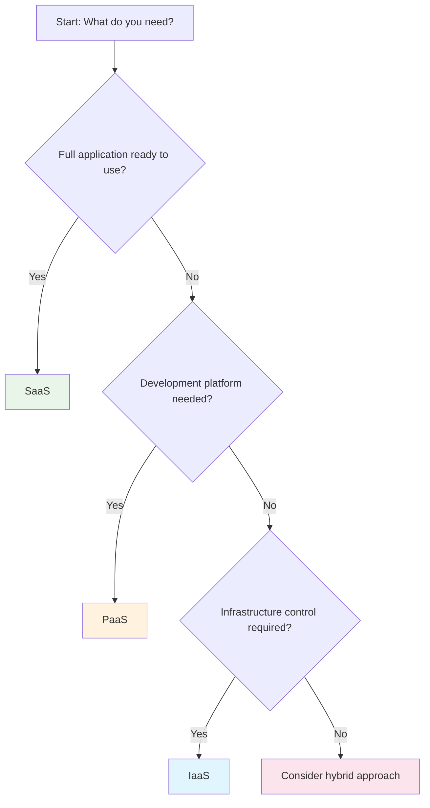

Cloud computing services are typically categorized into three primary service models, each offering different levels of control, flexibility, and management responsibility. Understanding these models is crucial for selecting the right cloud strategy for your organization's needs.

## The Cloud Service Stack

The cloud service models can be visualized as a stack, where each layer builds upon the previous one:

```
┌─────────────────────────────────────┐
│        Software as a Service        │  ← SaaS
│              (SaaS)                 │
├─────────────────────────────────────┤
│       Platform as a Service         │  ← PaaS
│              (PaaS)                 │
├─────────────────────────────────────┤
│     Infrastructure as a Service     │  ← IaaS
│              (IaaS)                 │
├─────────────────────────────────────┤
│        Physical Infrastructure      │  ← On-Premises
└─────────────────────────────────────┘
```

## Infrastructure as a Service (IaaS)

### Definition
IaaS provides virtualized computing resources over the internet. It offers the most basic cloud service model, providing virtual machines, storage, networks, and operating systems on a pay-as-you-go basis.

### Key Components
#### Compute Resources
- **Virtual Machines**: Scalable compute instances
- **Container Services**: Docker and Kubernetes support
- **Bare Metal Servers**: Dedicated physical servers
- **Serverless Computing**: Function-as-a-Service (FaaS)

#### Storage Services
- **Block Storage**: High-performance storage for databases
- **Object Storage**: Scalable storage for files and backups
- **File Storage**: Network-attached storage (NAS)
- **Archive Storage**: Long-term, low-cost storage

#### Networking
- **Virtual Networks**: Software-defined networking
- **Load Balancers**: Traffic distribution
- **Content Delivery Networks (CDN)**: Global content distribution
- **VPN Gateways**: Secure connectivity

### Responsibility Model
```
Customer Responsibilities:
├── Applications
├── Data
├── Runtime
├── Middleware
├── Operating System
└── Security Configuration

Provider Responsibilities:
├── Virtualization
├── Servers
├── Storage
├── Networking
└── Physical Security
```

### Popular IaaS Providers
- **Amazon Web Services (AWS)**: EC2, S3, VPC
- **Microsoft Azure**: Virtual Machines, Blob Storage, Virtual Network
- **Google Cloud Platform (GCP)**: Compute Engine, Cloud Storage, VPC
- **IBM Cloud**: Virtual Servers, Cloud Object Storage
- **Oracle Cloud**: Compute, Block Storage, Networking

### Use Cases
#### Development and Testing
```bash
# Example: Spinning up a development environment
aws ec2 run-instances \
    --image-id ami-0abcdef1234567890 \
    --count 1 \
    --instance-type t3.micro \
    --key-name my-key-pair \
    --security-groups my-sg
```

#### Disaster Recovery
- Replicate on-premises infrastructure in the cloud
- Automated failover and failback procedures
- Cost-effective backup solutions

#### High-Performance Computing (HPC)
- Scientific simulations and modeling
- Financial risk analysis
- Genomics research

### Advantages and Disadvantages
```
Advantages:
✓ Maximum control and flexibility
✓ Cost-effective for variable workloads
✓ No upfront hardware investment
✓ Rapid scaling capabilities

Disadvantages:
✗ Requires technical expertise
✗ Higher management overhead
✗ Security configuration complexity
✗ Potential for vendor lock-in
```

## Platform as a Service (PaaS)

### Definition
PaaS provides a platform allowing customers to develop, run, and manage applications without dealing with the underlying infrastructure. It includes operating systems, development tools, database management systems, and web servers.

### Key Components
#### Development Tools
- **Integrated Development Environments (IDEs)**
- **Version Control Systems**
- **Debugging and Testing Tools**
- **Collaboration Platforms**

#### Runtime Environments
- **Application Servers**: Java, .NET, Node.js, Python
- **Database Services**: SQL and NoSQL databases
- **Caching Services**: Redis, Memcached
- **Message Queues**: Asynchronous communication

#### Deployment and Management
- **Continuous Integration/Continuous Deployment (CI/CD)**
- **Auto-scaling**: Automatic resource adjustment
- **Monitoring and Logging**: Application performance insights
- **Security Services**: Authentication and authorization

### Responsibility Model
```
Customer Responsibilities:
├── Applications
├── Data
└── Configuration

Provider Responsibilities:
├── Runtime
├── Middleware
├── Operating System
├── Virtualization
├── Servers
├── Storage
├── Networking
└── Physical Security
```

### Popular PaaS Providers
- **Heroku**: Simple application deployment
- **Google App Engine**: Serverless application platform
- **Microsoft Azure App Service**: Web and mobile app platform
- **AWS Elastic Beanstalk**: Easy application deployment
- **Red Hat OpenShift**: Enterprise Kubernetes platform

### Development Workflow Example
```javascript
// Example: Deploying a Node.js app to Heroku
// 1. Create package.json
{
  "name": "my-cloud-app",
  "version": "1.0.0",
  "scripts": {
    "start": "node server.js"
  },
  "dependencies": {
    "express": "^4.18.0"
  }
}

// 2. Create server.js
const express = require('express');
const app = express();
const port = process.env.PORT || 3000;

app.get('/', (req, res) => {
  res.send('Hello Cloud Computing!');
});

app.listen(port, () => {
  console.log(`Server running on port ${port}`);
});

// 3. Deploy to Heroku
// git init
// git add .
// git commit -m "Initial commit"
// heroku create my-cloud-app
// git push heroku main
```

### Use Cases
#### Web Application Development
- Rapid prototyping and development
- Microservices architecture
- API development and management

#### Mobile Backend Services
- User authentication and management
- Push notifications
- Data synchronization

#### Integration and APIs
- Enterprise application integration
- Third-party service connections
- Data transformation and processing

### Advantages and Disadvantages
```
Advantages:
✓ Faster time to market
✓ Reduced development complexity
✓ Built-in scalability and availability
✓ Focus on business logic

Disadvantages:
✗ Less control over infrastructure
✗ Potential vendor lock-in
✗ Limited customization options
✗ Runtime environment constraints
```

## Software as a Service (SaaS)

### Definition
SaaS delivers software applications over the internet, on a subscription basis. Users access the software through web browsers or mobile apps, without needing to install, maintain, or update the software locally.

### Key Characteristics
#### Multi-Tenancy
- Single application instance serves multiple customers
- Shared infrastructure with data isolation
- Economies of scale for providers

#### Subscription-Based Pricing
- Monthly or annual subscription fees
- Per-user or per-feature pricing models
- Freemium and tiered pricing options

#### Automatic Updates
- Seamless software updates and patches
- New features rolled out automatically
- No user intervention required

### Responsibility Model
```
Customer Responsibilities:
├── Data
├── User Management
└── Configuration

Provider Responsibilities:
├── Applications
├── Data Security
├── Runtime
├── Middleware
├── Operating System
├── Virtualization
├── Servers
├── Storage
├── Networking
└── Physical Security
```

### Categories of SaaS Applications
#### Productivity and Collaboration
- **Microsoft 365**: Office applications, Teams, SharePoint
- **Google Workspace**: Gmail, Docs, Drive, Meet
- **Slack**: Team communication and collaboration
- **Zoom**: Video conferencing and webinars

#### Customer Relationship Management (CRM)
- **Salesforce**: Comprehensive CRM platform
- **HubSpot**: Inbound marketing and sales
- **Zendesk**: Customer support and service

#### Enterprise Resource Planning (ERP)
- **SAP SuccessFactors**: Human resources management
- **NetSuite**: Financial and business management
- **Workday**: HR and financial management

#### Specialized Applications
- **Adobe Creative Cloud**: Design and creative tools
- **Dropbox**: File storage and sharing
- **Mailchimp**: Email marketing automation

### Integration and APIs
```javascript
// Example: Integrating with Salesforce API
const salesforce = require('node-salesforce');

const conn = new salesforce.Connection({
  loginUrl: 'https://login.salesforce.com'
});

// Login to Salesforce
conn.login(username, password + securityToken, (err, userInfo) => {
  if (err) return console.error(err);
  
  // Query accounts
  conn.query('SELECT Id, Name FROM Account LIMIT 10', (err, result) => {
    if (err) return console.error(err);
    console.log('Total accounts:', result.totalSize);
    console.log('Accounts:', result.records);
  });
});
```

### Use Cases
#### Small and Medium Businesses (SMBs)
- Cost-effective access to enterprise-grade software
- No IT infrastructure investment required
- Rapid deployment and user onboarding

#### Remote and Distributed Teams
- Anywhere, anytime access to applications
- Real-time collaboration capabilities
- Consistent user experience across devices

#### Specialized Workflows
- Industry-specific applications
- Compliance and regulatory requirements
- Integration with existing business processes

### Advantages and Disadvantages
```
Advantages:
✓ No installation or maintenance required
✓ Automatic updates and patches
✓ Accessible from anywhere
✓ Predictable subscription costs
✓ Rapid deployment

Disadvantages:
✗ Limited customization options
✗ Data security and privacy concerns
✗ Internet dependency
✗ Potential vendor lock-in
✗ Ongoing subscription costs
```

## Choosing the Right Service Model

### Decision Framework


### Comparison Matrix
| Aspect | IaaS | PaaS | SaaS |
|--------|------|------|------|
| **Control** | High | Medium | Low |
| **Flexibility** | High | Medium | Low |
| **Management Overhead** | High | Medium | Low |
| **Time to Market** | Slow | Fast | Immediate |
| **Customization** | High | Medium | Low |
| **Cost Predictability** | Variable | Predictable | Predictable |
| **Technical Expertise** | High | Medium | Low |

### Hybrid and Multi-Cloud Strategies
Many organizations use a combination of service models:

```
Example Architecture:
├── SaaS: Office 365 for productivity
├── PaaS: Azure App Service for web applications
├── IaaS: AWS EC2 for legacy applications
└── On-Premises: Sensitive data and compliance systems
```

## Future Trends in Service Models

### Emerging Models
- **Function as a Service (FaaS)**: Serverless computing
- **Container as a Service (CaaS)**: Managed container platforms
- **Backend as a Service (BaaS)**: Mobile backend services
- **Database as a Service (DBaaS)**: Managed database services

### Industry Evolution
- **Serverless-First**: Moving towards event-driven architectures
- **AI/ML as a Service**: Machine learning platforms and APIs
- **Edge Computing**: Distributed cloud services
- **Quantum Computing as a Service**: Emerging quantum platforms

## Conclusion

Understanding the three primary cloud service models—IaaS, PaaS, and SaaS—is fundamental to making informed decisions about cloud adoption. Each model offers different trade-offs between control, flexibility, and management overhead. The choice depends on your organization's technical expertise, business requirements, and strategic objectives.

In the next lesson, we'll explore cloud deployment models and how they complement these service models to provide comprehensive cloud solutions.
