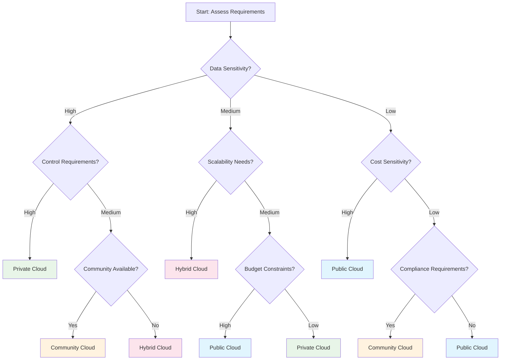

Cloud deployment models define how cloud infrastructure is deployed, who has access to it, and how it's managed. Understanding these models is crucial for organizations to choose the right cloud strategy that aligns with their security, compliance, and business requirements.

## Overview of Deployment Models

The four primary cloud deployment models each offer different levels of control, security, and cost considerations:

```
┌─────────────────┬─────────────────┬─────────────────┬─────────────────┐
│   Public Cloud  │  Private Cloud  │  Hybrid Cloud   │ Community Cloud │
├─────────────────┼─────────────────┼─────────────────┼─────────────────┤
│ Shared          │ Dedicated       │ Mixed           │ Shared by Group │
│ Multi-tenant    │ Single-tenant   │ Best of Both    │ Common Interests│
│ Cost-effective  │ High Control    │ Flexible        │ Cost Sharing    │
│ Scalable        │ Secure          │ Complex         │ Specialized     │
└─────────────────┴─────────────────┴─────────────────┴─────────────────┘
```

## Public Cloud

### Definition
Public cloud refers to cloud services offered by third-party providers over the public internet, making them available to anyone who wants to use or purchase them. Resources are shared among multiple organizations (multi-tenancy).

### Key Characteristics
#### Shared Infrastructure
- Multiple customers share the same physical infrastructure
- Resources are dynamically allocated based on demand
- Economies of scale drive down costs
- High resource utilization efficiency

#### Internet-Based Access
- Services accessed via public internet
- Global availability and accessibility
- Standard web protocols and interfaces
- No special network connections required

#### Pay-Per-Use Model
- No upfront capital investment
- Operational expense (OpEx) model
- Granular billing based on actual usage
- Transparent pricing structures

### Architecture Components
```
Public Cloud Architecture:
┌─────────────────────────────────────────────────────────────┐
│                    Internet Gateway                          │
├─────────────────────────────────────────────────────────────┤
│  Load Balancers │ CDN │ DNS │ Security Services │ APIs      │
├─────────────────────────────────────────────────────────────┤
│        Compute Services        │    Storage Services         │
│  ┌─────┐ ┌─────┐ ┌─────┐     │  ┌─────┐ ┌─────┐ ┌─────┐   │
│  │ VM1 │ │ VM2 │ │ VM3 │     │  │ S3  │ │ EBS │ │ EFS │   │
│  └─────┘ └─────┘ └─────┘     │  └─────┘ └─────┘ └─────┘   │
├─────────────────────────────────────────────────────────────┤
│              Hypervisor & Orchestration Layer               │
├─────────────────────────────────────────────────────────────┤
│                Physical Infrastructure                       │
└─────────────────────────────────────────────────────────────┘
```

### Major Public Cloud Providers
#### Amazon Web Services (AWS)
- **Market Leader**: Largest market share globally
- **Comprehensive Services**: 200+ services across all categories
- **Global Reach**: 31 regions, 99 availability zones
- **Enterprise Focus**: Strong enterprise and government adoption

#### Microsoft Azure
- **Hybrid Strength**: Excellent integration with on-premises Microsoft stack
- **Enterprise Integration**: Strong Office 365 and Windows Server integration
- **AI and Analytics**: Advanced machine learning and data services
- **Government Cloud**: Dedicated government and compliance offerings

#### Google Cloud Platform (GCP)
- **Data and AI**: Leading in big data and machine learning services
- **Kubernetes**: Native Kubernetes and container services
- **Network Infrastructure**: Global fiber network and edge locations
- **Open Source**: Strong commitment to open-source technologies

### Use Cases and Examples
#### Startups and SMBs
```javascript
// Example: Deploying a startup's web application
const express = require('express');
const app = express();

// Simple web server that can scale globally
app.get('/', (req, res) => {
  res.json({
    message: 'Hello from Public Cloud!',
    server: process.env.SERVER_REGION || 'us-east-1',
    timestamp: new Date().toISOString()
  });
});

// Auto-scaling configuration
const port = process.env.PORT || 3000;
app.listen(port, () => {
  console.log(`Server running on port ${port}`);
});
```

#### Global Applications
- Content delivery networks (CDN)
- Multi-region deployments
- Global user base support
- 24/7 availability requirements

#### Development and Testing
- Rapid environment provisioning
- Cost-effective testing infrastructure
- Parallel development environments
- Continuous integration/deployment

### Advantages and Disadvantages
```
Advantages:
✓ Low upfront costs and capital investment
✓ Rapid scalability and global reach
✓ Managed services and reduced operational overhead
✓ Access to latest technologies and innovations
✓ High availability and disaster recovery
✓ Pay-as-you-use pricing model

Disadvantages:
✗ Limited control over infrastructure
✗ Security and compliance concerns
✗ Data sovereignty and location issues
✗ Potential vendor lock-in
✗ Internet dependency
✗ Shared resource performance variability
```

## Private Cloud

### Definition
Private cloud refers to cloud computing resources used exclusively by a single business or organization. The private cloud can be physically located at the organization's on-site datacenter, or hosted by a third-party service provider.

### Key Characteristics
#### Dedicated Resources
- Single-tenant environment
- Dedicated hardware and infrastructure
- Isolated network and security boundaries
- Customizable resource allocation

#### Enhanced Security and Control
- Complete control over data and applications
- Customizable security policies and procedures
- Compliance with strict regulatory requirements
- Direct management of access controls

#### Customization Flexibility
- Tailored to specific business requirements
- Custom configurations and optimizations
- Integration with existing systems and processes
- Specialized hardware and software stacks

### Types of Private Cloud
#### On-Premises Private Cloud
```
On-Premises Architecture:
┌─────────────────────────────────────────────────────────────┐
│                    Corporate Network                         │
├─────────────────────────────────────────────────────────────┤
│  Firewall │ VPN │ Load Balancers │ Monitoring │ Backup     │
├─────────────────────────────────────────────────────────────┤
│        Private Cloud Management Platform                     │
│  ┌─────────────┐ ┌─────────────┐ ┌─────────────┐           │
│  │  VMware     │ │  OpenStack  │ │  Hyper-V    │           │
│  │  vSphere    │ │             │ │             │           │
│  └─────────────┘ └─────────────┘ └─────────────┘           │
├─────────────────────────────────────────────────────────────┤
│                Company-Owned Hardware                        │
└─────────────────────────────────────────────────────────────┘
```

#### Hosted Private Cloud
- Third-party provider manages infrastructure
- Dedicated resources in provider's datacenter
- Managed services and support
- Reduced operational overhead

#### Virtual Private Cloud (VPC)
- Logically isolated section of public cloud
- Private network within public cloud infrastructure
- Configurable network settings and security
- Bridge between public and private models

### Implementation Technologies
#### Virtualization Platforms
```yaml
# Example: VMware vSphere configuration
cluster:
  name: "production-cluster"
  hosts:
    - esxi-host-01.company.com
    - esxi-host-02.company.com
    - esxi-host-03.company.com
  
  resources:
    cpu_cores: 192
    memory_gb: 1536
    storage_tb: 50
  
  policies:
    ha_enabled: true
    drs_enabled: true
    admission_control: true
```

#### Container Orchestration
```yaml
# Example: Kubernetes private cloud setup
apiVersion: v1
kind: Namespace
metadata:
  name: private-cloud-apps

---
apiVersion: apps/v1
kind: Deployment
metadata:
  name: internal-app
  namespace: private-cloud-apps
spec:
  replicas: 3
  selector:
    matchLabels:
      app: internal-app
  template:
    metadata:
      labels:
        app: internal-app
    spec:
      containers:
      - name: app
        image: company-registry/internal-app:v1.0
        ports:
        - containerPort: 8080
        resources:
          requests:
            memory: "256Mi"
            cpu: "250m"
          limits:
            memory: "512Mi"
            cpu: "500m"
```

### Use Cases
#### Highly Regulated Industries
- **Financial Services**: Banking, insurance, trading
- **Healthcare**: HIPAA compliance, patient data protection
- **Government**: Classified information, national security
- **Legal**: Attorney-client privilege, confidential documents

#### Mission-Critical Applications
- Core business systems
- Real-time transaction processing
- Legacy application modernization
- High-performance computing workloads

#### Data Sovereignty Requirements
- Regulatory compliance (GDPR, SOX, PCI-DSS)
- Geographic data residency requirements
- Industry-specific regulations
- Corporate governance policies

### Advantages and Disadvantages
```
Advantages:
✓ Maximum control and customization
✓ Enhanced security and compliance
✓ Predictable performance and resources
✓ Data sovereignty and location control
✓ Integration with existing infrastructure
✓ Dedicated support and SLAs

Disadvantages:
✗ High upfront capital investment
✗ Ongoing operational and maintenance costs
✗ Limited scalability compared to public cloud
✗ Requires specialized IT expertise
✗ Longer deployment and provisioning times
✗ Technology refresh and upgrade responsibilities
```

## Hybrid Cloud

### Definition
Hybrid cloud combines public and private clouds, bound together by technology that allows data and applications to be shared between them. This model provides greater flexibility and more deployment options.

### Key Characteristics
#### Seamless Integration
- Unified management across environments
- Consistent APIs and interfaces
- Automated workload orchestration
- Single pane of glass monitoring

#### Workload Portability
- Applications can move between environments
- Data synchronization and replication
- Consistent development and deployment processes
- Cloud-native and legacy application support

#### Optimal Resource Utilization
- Burst to public cloud for peak demands
- Keep sensitive data in private cloud
- Cost optimization through intelligent placement
- Performance optimization based on requirements

### Architecture Patterns
#### Cloud Bursting
```
Normal Operations:
┌─────────────────┐    ┌─────────────────┐
│  Private Cloud  │    │   Public Cloud  │
│                 │    │                 │
│ ████████████    │    │                 │
│ Active Workload │    │    (Standby)    │
│                 │    │                 │
└─────────────────┘    └─────────────────┘

Peak Demand:
┌─────────────────┐    ┌─────────────────┐
│  Private Cloud  │────│   Public Cloud  │
│                 │    │                 │
│ ████████████    │    │ ████████████    │
│ Base Workload   │    │ Burst Workload  │
│                 │    │                 │
└─────────────────┘    └─────────────────┘
```

#### Data Tiering
```javascript
// Example: Hybrid data management strategy
class HybridDataManager {
  constructor() {
    this.privateCloud = new PrivateCloudStorage();
    this.publicCloud = new PublicCloudStorage();
  }

  async storeData(data, classification) {
    switch(classification) {
      case 'sensitive':
        return await this.privateCloud.store(data, {
          encryption: 'AES-256',
          location: 'on-premises'
        });
      
      case 'public':
        return await this.publicCloud.store(data, {
          redundancy: 'multi-region',
          cost_optimization: true
        });
      
      case 'archive':
        return await this.publicCloud.store(data, {
          storage_class: 'glacier',
          retrieval_time: '12-hours'
        });
      
      default:
        return await this.privateCloud.store(data);
    }
  }

  async processWorkload(workload) {
    const demand = workload.estimateResources();
    
    if (demand.cpu > this.privateCloud.availableCapacity()) {
      // Burst to public cloud
      return await this.publicCloud.process(workload);
    } else {
      return await this.privateCloud.process(workload);
    }
  }
}
```

### Implementation Approaches
#### Network Connectivity
```
Hybrid Connectivity Options:
┌─────────────────┐    ┌─────────────────┐
│  Private Cloud  │    │   Public Cloud  │
│                 │    │                 │
│     ┌─────┐     │    │     ┌─────┐     │
│     │ App │◄────┼────┼────►│ App │     │
│     └─────┘     │    │     └─────┘     │
│                 │    │                 │
└─────────────────┘    └─────────────────┘
        │                       │
        └───── VPN/DirectConnect ─────┘
```

#### Container Orchestration
```yaml
# Example: Multi-cloud Kubernetes federation
apiVersion: v1
kind: ConfigMap
metadata:
  name: hybrid-config
data:
  private_cluster: "https://k8s-private.company.com"
  public_cluster: "https://k8s-public.cloud-provider.com"
  
---
apiVersion: apps/v1
kind: Deployment
metadata:
  name: hybrid-app
spec:
  replicas: 5
  template:
    spec:
      affinity:
        nodeAffinity:
          preferredDuringSchedulingIgnoredDuringExecution:
          - weight: 80
            preference:
              matchExpressions:
              - key: cloud-type
                operator: In
                values: ["private"]
          - weight: 20
            preference:
              matchExpressions:
              - key: cloud-type
                operator: In
                values: ["public"]
```

### Use Cases
#### Digital Transformation
- Gradual migration to cloud
- Legacy system modernization
- Risk mitigation during transition
- Skill development and learning

#### Compliance and Governance
- Sensitive data in private cloud
- Non-sensitive workloads in public cloud
- Regulatory requirement compliance
- Data residency and sovereignty

#### Cost Optimization
- Base capacity in private cloud
- Peak demand in public cloud
- Development/testing in public cloud
- Production in private cloud

### Advantages and Disadvantages
```
Advantages:
✓ Flexibility and choice in deployment
✓ Cost optimization opportunities
✓ Risk mitigation and gradual adoption
✓ Compliance with regulatory requirements
✓ Scalability when needed
✓ Best of both worlds approach

Disadvantages:
✗ Increased complexity in management
✗ Integration and interoperability challenges
✗ Security across multiple environments
✗ Skill requirements for multiple platforms
✗ Potential for increased costs
✗ Network latency and connectivity issues
```

## Community Cloud

### Definition
Community cloud is a collaborative effort where infrastructure is shared between several organizations from a specific community with common concerns (security, compliance, jurisdiction, etc.), whether managed internally or by a third party.

### Key Characteristics
#### Shared Governance
- Joint decision-making processes
- Shared costs and responsibilities
- Common policies and procedures
- Collaborative management structure

#### Common Requirements
- Similar compliance needs
- Shared security standards
- Common regulatory framework
- Industry-specific requirements

#### Cost Sharing
- Economies of scale among participants
- Shared infrastructure investment
- Reduced individual organization costs
- Collaborative purchasing power

### Implementation Models
#### Industry-Specific Clouds
```
Healthcare Community Cloud:
┌─────────────────────────────────────────────────────────────┐
│                 Healthcare Cloud Consortium                  │
├─────────────────┬─────────────────┬─────────────────────────┤
│   Hospital A    │   Hospital B    │    Medical Research     │
│                 │                 │       Institute         │
│ ┌─────────────┐ │ ┌─────────────┐ │ ┌─────────────────────┐ │
│ │   EHR       │ │ │   EHR       │ │ │   Research Data     │ │
│ │   System    │ │ │   System    │ │ │   Analytics         │ │
│ └─────────────┘ │ └─────────────┘ │ └─────────────────────┘ │
├─────────────────┴─────────────────┴─────────────────────────┤
│              Shared HIPAA-Compliant Infrastructure           │
│  ┌─────────┐ ┌─────────┐ ┌─────────┐ ┌─────────────────┐   │
│  │ Compute │ │ Storage │ │ Network │ │ Security/Audit  │   │
│  └─────────┘ └─────────┘ └─────────┘ └─────────────────┘   │
└─────────────────────────────────────────────────────────────┘
```

#### Government Clouds
- **FedRAMP**: US Federal Risk and Authorization Management Program
- **GovCloud**: Dedicated government cloud regions
- **Sovereign Clouds**: National government cloud initiatives
- **Defense Clouds**: Military and defense-specific requirements

#### Research and Education
```yaml
# Example: Academic research cloud configuration
community:
  name: "University Research Consortium"
  members:
    - university_a
    - university_b
    - research_institute_c
  
  shared_resources:
    compute:
      high_performance_computing: true
      gpu_clusters: true
      quantum_simulators: true
    
    storage:
      research_data_lake: 100TB
      backup_retention: "7_years"
      data_sharing_policies: "open_science"
    
    software:
      matlab_licenses: 500
      ansys_licenses: 100
      custom_research_tools: true
  
  governance:
    cost_sharing: "proportional_usage"
    data_policies: "institutional_review_board"
    security_standards: "NIST_800_171"
```

### Examples and Use Cases
#### Financial Services
- **SWIFT**: Secure financial messaging
- **Banking Consortiums**: Shared fraud detection
- **Regulatory Reporting**: Common compliance platforms
- **Risk Management**: Shared risk analytics

#### Healthcare
- **HIE**: Health Information Exchange
- **Research Collaborations**: Multi-institutional studies
- **Telemedicine**: Shared telehealth platforms
- **Public Health**: Disease surveillance systems

#### Government and Public Sector
- **Inter-agency Collaboration**: Shared government services
- **Emergency Response**: Disaster management systems
- **Citizen Services**: Shared public service platforms
- **Smart Cities**: Municipal service integration

### Advantages and Disadvantages
```
Advantages:
✓ Cost sharing among community members
✓ Enhanced security through collaboration
✓ Compliance with industry standards
✓ Shared expertise and best practices
✓ Economies of scale
✓ Reduced vendor lock-in risk

Disadvantages:
✗ Complex governance and decision-making
✗ Potential conflicts of interest
✗ Limited flexibility for individual needs
✗ Dependency on community consensus
✗ Shared responsibility for failures
✗ Exit strategy complications
```

## Choosing the Right Deployment Model

### Decision Framework


### Comparison Matrix
| Factor | Public | Private | Hybrid | Community |
|--------|--------|---------|--------|-----------|
| **Cost** | Low | High | Medium | Medium |
| **Control** | Low | High | Medium | Medium |
| **Security** | Medium | High | Medium | High |
| **Scalability** | High | Medium | High | Medium |
| **Compliance** | Medium | High | High | High |
| **Complexity** | Low | Medium | High | High |
| **Time to Deploy** | Fast | Slow | Medium | Slow |

## Future Trends in Deployment Models

### Edge Computing Integration
- Distributed cloud infrastructure
- IoT and real-time processing
- Reduced latency requirements
- Local data processing

### Multi-Cloud Strategies
- Vendor diversification
- Best-of-breed services
- Risk mitigation
- Regulatory compliance

### Serverless and Function-as-a-Service
- Event-driven architectures
- Micro-deployment models
- Pay-per-execution pricing
- Reduced operational overhead

## Conclusion

Understanding cloud deployment models is essential for making informed decisions about cloud strategy. Each model offers different trade-offs in terms of cost, control, security, and complexity. The choice depends on your organization's specific requirements, including:

- Data sensitivity and compliance needs
- Control and customization requirements
- Budget and cost considerations
- Scalability and performance needs
- Technical expertise and resources

Many organizations adopt a multi-cloud or hybrid approach, leveraging different deployment models for different workloads and requirements. The key is to align your deployment strategy with your business objectives and technical constraints.

In the next lesson, we'll explore the benefits and challenges of cloud computing, helping you understand the full impact of cloud adoption on your organization.
