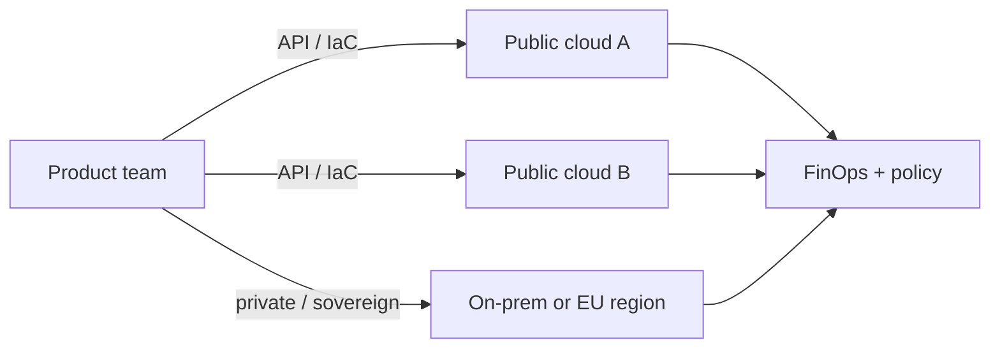

This optional lesson does **not** replace the NIST characteristics, service models, or deployment models in the required notes. It shows how those ideas show up in production systems between about 2022 and 2026: multi-cloud estates, FinOps as measured service, sovereign-cloud constraints, and AI serving as a new first-class cloud workload.

## Learning objectives

- Map NIST *rapid elasticity* and *measured service* onto FinOps practice and AI capacity planning.
- Distinguish *multi-cloud by accident* from *multi-cloud by design* (data residency, best-of-breed services, exit options).
- Sketch an AI-serving path that still respects IaaS/PaaS/SaaS boundaries.

## 1. Multi-cloud is the steady state, not a slogan

Flexera’s *2025 State of the Cloud Report* (14th edition; 750+ practitioners) finds that **70%** of organizations run a hybrid mix of at least one public and one private cloud, and that estates typically span about **2.4 public providers**. Managing spend is the top challenge for **84%** of respondents; dedicated FinOps teams that own some or all cost optimization rose from **51% to 59%** year over year. Expected spend growth (~28%) and estimated IaaS/PaaS waste (~27%) sit beside a modest repatriation rate (~21% of workloads), so the net cloud footprint is still growing.

That is the NIST model under load: **resource pooling** across providers, **on-demand self-service** via APIs, and **measured service** that finance teams can no longer treat as a rounding error.



**Design question.** If a service can run on only one provider’s proprietary API, you have a *deployment* model (public cloud) but not a *portable* architecture. Portability is a product requirement, not a default.

## 2. FinOps is measured service with a feedback loop

NIST *measured service* stops at metering. FinOps adds allocation, forecasting, and unit economics (cost per checkout, per inference, per tenant). A minimal loop:

1. **Tag and allocate** every billable resource (team, environment, product).
2. **Show unit cost** next to SLOs (p99 latency, error rate), not only next to the invoice.
3. **Act**: rightsizing, reserved/spot mix, scale-to-zero, or *repatriation* when the economics invert.

Python-shaped sketch of a unit-cost check you could hang off a monthly bill export:

```python
def unit_cost(invoice_usd: float, successful_inferences: int) -> float:
    if successful_inferences <= 0:
        raise ValueError("no successful work to allocate cost against")
    return invoice_usd / successful_inferences

# Example: GPU serving cluster vs. managed AI API
gpu_unit = unit_cost(18_400.0, successful_inferences=2_100_000)
api_unit = unit_cost(9_250.0, successful_inferences=2_100_000)
print(f"GPU ${gpu_unit:.4f}  vs  API ${api_unit:.4f} per inference")
```

The number is not the strategy. The strategy is making **elasticity visible** so teams stop treating the cloud as an infinite CapEx substitute.

## 3. AI serving as a cloud application pattern

Generative AI did not invent new NIST characteristics; it stressed them. A typical 2024–2026 serving stack:

| Layer | Role | Cloud mapping |
| --- | --- | --- |
| Client / BFF | Auth, quotas, prompt policy | SaaS or custom PaaS |
| Inference router | Model version, A/B, cache | PaaS / service mesh |
| Engine (e.g. vLLM) | Batched GPU decode | IaaS + GPU SKUs |
| Orchestrator (KServe, Ray Serve) | Scale, canary, protocols | Kubernetes / PaaS |

KServe (CNCF incubating as of late 2025) treats an `InferenceService` as a Kubernetes resource with scale-to-zero and canary traffic. Ray Serve composes Python graphs (retrieve → rerank → generate) on KubeRay. Both commonly wrap **vLLM** for OpenAI-compatible HTTP. Students should notice the SOA move: the *model* is a versioned service with an SLA, not a notebook artifact.

<div class="content-box warning-box">
<p><strong>Cold start vs. GPU cost.</strong> Scale-to-zero is elegant on paper and expensive in tail latency for LLMs. Production teams often set <code>minReplicas: 1</code> and buy elasticity on the <em>replica</em> axis, not the zero axis.</p>
</div>

## 4. Sovereignty and compliance reshape deployment models

Public / private / hybrid / community still apply, but *where the bytes live* now drives architecture. EU data-protection and sector rules, plus customer contracts, push **sovereign regions**, customer-managed keys, and “data never leaves this VPC” designs. Hybrid is no longer only “legacy in the basement”: it is often the *compliance* plane sitting beside a *commodity* public plane.

## Challenges

- **Accidental multi-cloud**: two providers because two teams picked defaults, with no identity, network, or data contract between them.
- **AI bill shock**: token and GPU hours are harder to forecast than VM hours.
- **Skills split**: FinOps, platform, and ML serving teams speak different SLOs.

## Exercises

1. Take one required-lesson example (e.g. an e-commerce burst). Add a second provider *only* for object storage. List the identity, latency, and egress costs you just accepted.
2. Using a public price page, estimate monthly cost for 10M short LLM calls on a managed API versus one reserved GPU. State your assumptions.
3. Write a six-line data-residency policy: which logs, embeddings, and prompts may leave Vietnam / the EU, and which must not.

## References

1. Flexera, *2025 State of the Cloud Report* (March 2025). [Press summary](https://www.flexera.com/about-us/press-center/new-flexera-report-finds-84-percent-of-organizations-struggle-to-manage-cloud-spend); [trends recap](https://www.flexera.com/blog/finops/the-latest-cloud-computing-trends-flexera-2025-state-of-the-cloud-report/).
2. Flexera, full report PDF: [Flexera-State-of-the-Cloud-Report-2025.pdf](https://resources.flexera.com/web/pdf/Flexera-State-of-the-Cloud-Report-2025.pdf).
3. CNCF / Linux Foundation Research, *Cloud Native 2024 Annual Survey* (published 1 April 2025): [report page](https://www.cncf.io/reports/cncf-annual-survey-2024/).
4. NIST SP 800-145, *The NIST Definition of Cloud Computing* (the required-lesson baseline these applications still implement).
5. vLLM project documentation and KServe *InferenceService* docs (CNCF; incubating announced November 2025).
