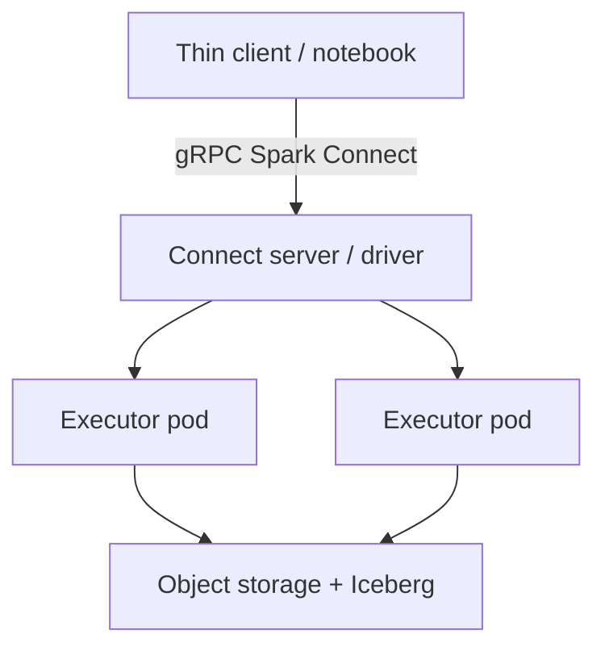

The required lesson covers drivers, executors, RDDs, and cluster managers (including Kubernetes). This optional note focuses on **applications that treat Spark as a remote service**: Spark Connect (since 3.4) and the **Spark 4.0.0** (23 May 2025) client/server story—plus why many 2022–2026 shops run Spark on Kubernetes instead of a standing YARN cluster.

## Learning objectives

- Explain Spark Connect as a gRPC decoupling of *user process* and *cluster session*.
- List what Spark 4.0 added for Connect clients (lightweight Python client, `spark.api.mode`, ML on Connect).
- Decide when RDD-era APIs block a Connect migration.

## 1. Why the fat driver became a problem

Classic Spark embeds the user’s JVM/Python process in the cluster’s control path. That is awkward for:

- Multi-tenant **data apps** and IDEs that should not ship a 200 MB PySpark.
- **Remote** notebooks that must not die when the driver is preempted.
- Language clients that are not JVM-first.

Spark Connect sends **unresolved logical plans** over gRPC. The server owns Catalyst/Tungsten; the client is a stub. Official docs: RDDs and `SparkContext` are **not** on the Connect path—DataFrame/SQL is.

```python
# Spark 4.0: switch Classic vs Connect without rewriting DataFrame code
from pyspark.sql import SparkSession

spark = (
    SparkSession.builder
    .config("spark.api.mode", "connect")  # Spark 4.0 convenience
    .remote("sc://spark-connect-server:15002")
    .getOrCreate()
)

df = spark.read.parquet("s3a://lab/events/")
df.groupBy("country").count().show()
```

Spark 4.0 highlights (project release notes): a **~1.5 MB `pyspark-client`**, an extra tarball with Connect on by default, Java client API parity, ML on Connect, and new clients (including Swift; community Go/Rust work). Databricks Runtime 17.0 ships Spark 4.0 for students who only have a managed playground.

## 2. Spark on Kubernetes as an application platform

2022–2026 platform teams often submit Spark as **Pods**:

- One isolated driver + executor set per job (or a long-lived Connect server Deployment).
- Node selectors for spot vs on-demand, GPU for pandas UDFs / Torch.
- The same observability stack (OTel, Prometheus) as the microservices.

This is the required architecture (driver/executors) with a different **cluster manager**. Shuffle service and dynamic allocation need extra Kubernetes plumbing; that is an *application* concern now, not only a Hadoop admin concern.



## 3. Application patterns

1. **Interactive analytics** — many users, one Connect endpoint, row-level security in the server.
2. **Scheduled features** — Kubernetes `CronJob` or Airflow that only needs the thin client in CI.
3. **Embedded Spark** — a Go or Python microservice that asks Spark to join 2 TB, then returns a small result (SOA: Spark is a *dependency*, not the whole app).

<div class="content-box warning-box">
<p><strong>RDD homework vs Connect.</strong> If your lab still requires <code>sc.parallelize</code> and explicit partitions, you are on Classic Spark. That is fine for teaching lineage; do not pretend it is the 2025 application default.</p>
</div>

## Challenges

- Connect API gaps (especially older RDD/ML code).
- A shared Connect server is a **noisy-neighbor** and a security boundary.
- Kubernetes shuffle/local disk is easier to get wrong than HDFS locality.

## Exercises

1. From the Spark 4.0 release notes, list three Connect items that help a *non-JVM* team.
2. Draw where Catalyst runs in Classic vs Connect.
3. Propose a namespace/quota design so student jobs cannot starve a shared Connect Deployment.

## References

1. Apache Spark, *Spark Release 4.0.0* (23 May 2025): [spark.apache.org/releases/spark-release-4-0-0.html](https://spark.apache.org/releases/spark-release-4-0-0.html).
2. Apache Spark, *Spark Connect*: [spark.apache.org/spark-connect](https://spark.apache.org/spark-connect/).
3. Apache Spark 4.0.0 docs, *Spark Connect Overview*: [spark-connect-overview.html](https://spark.apache.org/docs/4.0.0/spark-connect-overview.html).
4. Databricks blog, “Introducing Apache Spark 4.0”: [databricks.com/blog/introducing-apache-spark-40](https://www.databricks.com/blog/introducing-apache-spark-40).
5. Apache Spark, *Running Spark on Kubernetes* (current docs).
