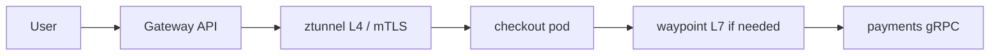

The required chapter explains Pods, Services, and Deployments. This optional lesson is the 2022–2026 *application networking* layer on top: **Gateway API** (GA October 2023; mesh + GRPCRoute in v1.1, May 2024), **Istio ambient mode** (GA in Istio 1.24), and **eBPF** data planes (Cilium). CNCF’s 2024 survey is important here: Kubernetes is ubiquitous (**80%** production), but **service mesh production use fell from 50% to 42%**—complexity is a first-class topic, not a footnote.

## Learning objectives

- Replace “Ingress object forever” with Gateway / HTTPRoute / GRPCRoute as the north–south contract.
- Contrast sidecar mesh vs ambient (ztunnel + optional waypoints).
- Decide when eBPF CNI policy is enough and when you still want L7 mesh policy.

## 1. Gateway API as the portable SOA edge

Gateway API v1.0 (31 October 2023) graduated `Gateway`, `GatewayClass`, and `HTTPRoute`. v1.1 (9 May 2024) moved **service-mesh use** (HTTPRoute `parentRef` to a Service) and **GRPCRoute** to the Standard channel. One route object can describe both ingress and east–west intent.

```yaml
apiVersion: gateway.networking.k8s.io/v1
kind: HTTPRoute
metadata:
  name: checkout
spec:
  parentRefs:
    - name: edge-gateway
  rules:
    - matches:
        - path: { type: PathPrefix, value: /checkout }
      backendRefs:
        - name: checkout
          port: 8080
```

Application teams own *routes*; platform teams own *Gateways*. That split is the SOA governance model Kubernetes was missing when everyone shared one giant Ingress controller annotation dialect.

## 2. Ambient mesh: mTLS without a sidecar tax

Istio ambient (announced 2022, **GA in 1.24**, late 2024) puts L4 in a node **ztunnel** and optional L7 in **waypoint** proxies. Goal: cryptographic identity and golden-signal telemetry *without* a sidecar in every Pod (the operational complaint behind the CNCF adoption dip).

Cilium (also CNCF graduated) implements much L3/L4 in **eBPF** and can add L7 via Envoy. Istio’s 2024 comparison notes the two are often **combined**: Cilium for CNI/NetworkPolicy, Istio for L7 and identity. Students should not treat them as mutually exclusive brands.



## 3. When *not* to add a mesh

Add a mesh when you need **portable identity** (SPIFFE), consistent timeouts, or L7 authz across languages. Skip it when you have three services and a single Ingress—CNCF’s drop from 50%→42% is a warning, not a failure of the idea.

<div class="content-box warning-box">
<p><strong>Mesh is not observability.</strong> You still need OpenTelemetry inside the app for business spans. The data plane gives you golden signals; it does not know <code>order.id</code>.</p>
</div>

## Challenges

- Two traffic APIs in one cluster (legacy Ingress + Gateway + VirtualService).
- Ambient + kube-proxy-replacement CNIs need documented flags so socket load-balancing does not bypass the mesh.
- GRPCRoute support lags HTTPRoute in some implementations—check the controller matrix.

## Exercises

1. Rewrite a simple Ingress YAML as Gateway + HTTPRoute. Who owns each object?
2. For a gRPC payments API, argue for GRPCRoute vs. HTTP/JSON at the edge.
3. Using the CNCF 2024 numbers, write a one-paragraph recommendation to a dean’s office: mesh or not for a 15-service campus system.

## References

1. Kubernetes blog, “Gateway API v1.0: GA Release” (31 Oct 2023): [kubernetes.io/blog/2023/10/31/gateway-api-ga](https://kubernetes.io/blog/2023/10/31/gateway-api-ga/).
2. Kubernetes blog, “Gateway API v1.1” (9 May 2024): [kubernetes.io/blog/2024/05/09/gateway-api-v1-1](https://kubernetes.io/blog/2024/05/09/gateway-api-v1-1/).
3. Istio, “Ambient Mode Reaches General Availability in v1.24”: [istio.io/latest/blog/2024/ambient-reaches-ga](https://istio.io/latest/blog/2024/ambient-reaches-ga/).
4. Istio, “Istio Ambient vs. Cilium” (2024): [istio.io/latest/blog/2024/ambient-vs-cilium](https://istio.io/latest/blog/2024/ambient-vs-cilium/).
5. CNCF *Cloud Native 2024 Annual Survey* (80% K8s; mesh 42%): [cncf.io/reports/cncf-annual-survey-2024](https://www.cncf.io/reports/cncf-annual-survey-2024/) and [PDF](https://www.cncf.io/wp-content/uploads/2025/04/cncf_annual_survey24_031225a.pdf).
