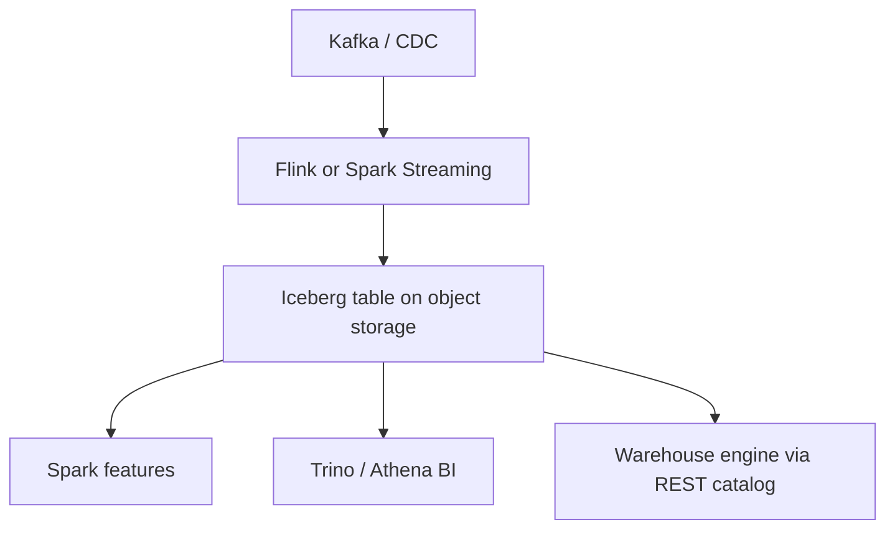

The required chapter defines platforms, pipelines, and Lambda/Kappa processing. This optional lesson is the 2022–2026 **open lakehouse** application: one copy of data in object storage, **Iceberg/Delta/Hudi** table metadata, and many engines (Spark, Flink, Trino, warehouse SaaS) sharing a **REST catalog**.

## Learning objectives

- Explain “write once, read in many engines” as a platform architecture, not a file-format trivia item.
- Place Apache Polaris / Iceberg REST catalogs in the onion of ingestion–storage–processing–query.
- Contrast lakehouse batch/stream with a proprietary warehouse-only platform.

## 1. The platform contract moved to the table

A 2015 Hadoop platform contract was “HDFS + Hive Metastore + YARN.” A 2025 contract is closer to:

1. **Object storage** (S3/GCS/ADLS) as the durable layer.
2. **Open table format** (Iceberg, Delta Lake, Hudi) for snapshots, schema evolution, and deletes.
3. **Catalog** that implements the Iceberg REST spec so Spark, Trino, and Flink see the same tables.
4. **Engines** you can swap without copying petabytes.

Snowflake donated **Polaris** (Iceberg REST catalog) to the ASF in 2024; it is widely discussed as vendor-neutral governance. Databricks acquired Tabular (Iceberg creators) in 2024 and ships **Delta UniForm** so a Delta table can present Iceberg metadata. Capital One’s 2025 engineering write-up frames this as *format convergence*: architects should assume multi-engine read.

A 2025 Iceberg-ecosystem survey (results posted 2026) reports Iceberg as the most-cited exclusive open format among *that* respondent set, with catalogs still fragmented (Glue, Nessie, S3 Tables, Polaris, …). Use surveys as **direction**, not as a single market number.

## 2. Application: multi-cloud analytics without a second ETL



The *application* is the product analytics mart, not the brand of SQL. Governance (who may `DELETE` a snapshot, which region holds PII) lives in the catalog + IAM, matching the required lesson’s data-governance section.

```sql
-- Engine-agnostic intent; dialect varies
SELECT country, count(*) AS n
FROM lake.events
WHERE event_date BETWEEN DATE '2026-09-01' AND DATE '2026-09-07'
GROUP BY 1;
```

## 3. Streaming + batch on one table (Kappa with a safety hatch)

Kappa said “stream is the source of truth.” Lakehouse practice is: stream **appends** + batch **compacts/rewrites** + time-travel for audit. That is still a platform (ingestion, storage, processing, query)—the onion from the required notes—with better atomicity than a raw `/events/2026/09/16/` directory.

<div class="content-box insight-box">
<p><strong>Data as product.</strong> An Iceberg table with an owner, SLO, and schema changelog is closer to a SOA <em>service</em> than a dump folder. The catalog is the registry.</p>
</div>

## Challenges

- Catalog fragmentation (two REST catalogs and you have two sources of truth).
- Small files and streaming ingest without scheduled rewrite jobs.
- Cross-cloud *egress* when the “open” table is in one hyperscaler’s bucket.

## Exercises

1. Map Hive Metastore + HDFS to Iceberg REST + object storage. What failure modes stay the same?
2. Design a PII table: which snapshots may leave the VN/EU region, and which engine is allowed to read them?
3. Why might a team keep Flink for ingest and Spark for backfill on the *same* Iceberg table?

## References

1. Apache Iceberg: [iceberg.apache.org](https://iceberg.apache.org/).
2. Databricks, “Delta UniForm”: [databricks.com/blog/delta-uniform-universal-format-lakehouse-interoperability](https://www.databricks.com/blog/delta-uniform-universal-format-lakehouse-interoperability).
3. Capital One Tech, “Lakehouse Convergence: Delta Lake & Iceberg” (2025): [capitalone.com/tech/cloud/lakehouse-format-convergence-delta-lake-iceberg](https://www.capitalone.com/tech/cloud/lakehouse-format-convergence-delta-lake-iceberg/).
4. Data Lakehouse Hub, 2025 Iceberg ecosystem survey results (Feb 2026): [datalakehousehub.com/blog/2026-02-state-of-the-apache-iceberg-ecosystem](https://datalakehousehub.com/blog/2026-02-state-of-the-apache-iceberg-ecosystem).
5. Apache Flink + Iceberg sink docs (streaming ingest pattern).
