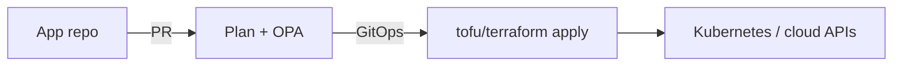

The required lesson introduces declarative IaC, Terraform resources/state, and Ansible. This optional note covers the **August 2023 license split** (Terraform BSL vs **OpenTofu** MPL 2.0 under the Linux Foundation), **policy as code** in the plan path, and platform engineering (golden modules) as the application of IaC in 2024–2026.

## Learning objectives

- State what changed on 10 August 2023 and why OpenTofu 1.6 (January 2024) exists.
- Add an OPA/Conftest-style policy so `apply` cannot create a public bucket by accident.
- Describe a platform team’s module registry as an internal SOA.

## 1. Two CLIs, one HCL habit

HashiCorp moved Terraform 1.6+ to **Business Source License 1.1** (not OSI-approved). A vendor coalition forked 1.5.x → OpenTF manifesto → **OpenTofu** at the Linux Foundation (joined September 2023; **1.6.0 stable 10 January 2024**). Day-to-day, `tofu` is largely a drop-in for existing HCL and providers. Divergence since then includes features such as native state encryption in OpenTofu. IBM’s acquisition of HashiCorp (2024–2025) is part of the governance story students should be able to name.

**Course stance:** learn the *ideas* (state, plan, providers). In labs, either CLI is fine; in industry, legal review may pick one.

```hcl
# Same mental model as the required Terraform lesson
resource "aws_s3_bucket" "raw" {
  bucket = "iuh-lab-raw-${var.env}"
}
```

## 2. Policy as code: the admission controller for infrastructure

Declarative IaC is not automatically *safe*. Policy engines (Open Policy Agent, Sentinel, Checkov, Terraform/OpenTofu language checks) evaluate the **plan JSON** before apply.

```rego
# Conftest / OPA-shaped rule (illustrative)
package terraform.s3

deny[msg] {
  some rc
  rc := input.resource_changes[_]
  rc.type == "aws_s3_bucket_public_access_block"
  rc.change.after.block_public_acls == false
  msg := sprintf("%s allows public ACLs", [rc.address])
}
```

This is the same *control-vs-data-plane* split as Kubernetes admission: developers declare intent; the platform enforces residency, tags (FinOps), and encryption.

## 3. Platform engineering: IaC as an internal product

By 2024, many orgs stopped handing every team a raw cloud account. A **platform team** publishes:

- Versioned modules (`eks-cluster/v4`, `postgres/v2`).
- A paved path (Backstage + GitOps + OPA).
- SLOs for “time to a new preview environment.”

CNCF’s 2024 survey highlights CI/CD and GitOps growth; IaC is the *definition*, Git is the *transport*, the cluster (Chapter 09) is the *runtime*. Multi-cloud (Chapter 12) shows up as two providers behind one module interface—not two copies of every repo.



<div class="content-box insight-box">
<p><strong>State is still the hard part.</strong> Whether the file is encrypted by OpenTofu or stored in HCP Terraform, the required lesson’s warning stands: two writers, one state, split-brain.</p>
</div>

## Challenges

- Provider/registry mirroring and lockfiles across forks.
- Module version pinning vs. “always latest” security patches.
- Policy packs that reject every student lab by accident.

## Exercises

1. Write a policy: every resource must have `tags.owner` and `tags.cost_center`.
2. In one paragraph, explain a case where BSL vs MPL would matter to a *vendor* building a SaaS around IaC, vs. a student applying a VM.
3. Design a golden module API for “student preview env” (inputs, outputs, max cost).

## References

1. OpenTofu project: [opentofu.org](https://opentofu.org/).
2. HashiCorp BSL announcement (10 August 2023) and OpenTofu 1.6.0 (10 January 2024) release notes.
3. Open Policy Agent: [openpolicyagent.org](https://www.openpolicyagent.org/).
4. CNCF *Cloud Native 2024 Annual Survey* (CI/CD, GitOps): [cncf.io/reports/cncf-annual-survey-2024](https://www.cncf.io/reports/cncf-annual-survey-2024/).
5. Required Terraform lesson — providers, resources, state — still the prerequisite.
