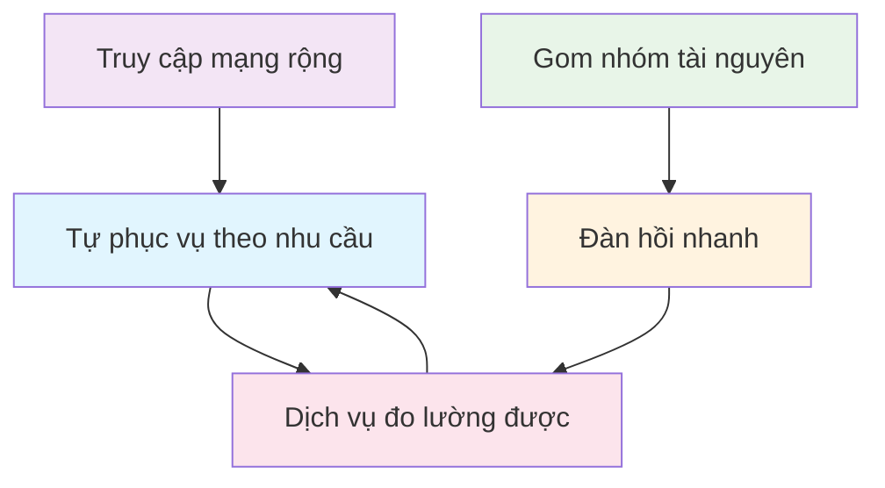

Viện Tiêu chuẩn và Công nghệ Quốc gia Hoa Kỳ (NIST) nêu năm đặc trưng cốt yếu phân biệt điện toán đám mây với các mô hình tính toán truyền thống. Hiểu các đặc trưng này là then chốt để nhận diện dịch vụ đám mây thực sự và ra quyết định có cơ sở khi áp dụng đám mây. Năm đặc trưng — tự phục vụ theo nhu cầu (on-demand self-service), truy cập mạng rộng (broad network access), gom nhóm tài nguyên (resource pooling), đàn hồi nhanh (rapid elasticity) và dịch vụ đo lường được (measured service) — cùng nhau định nghĩa những gì ngày nay ta gọi là “Cloud”.

## 1. Tự phục vụ theo nhu cầu (On-Demand Self-Service)

Tự phục vụ theo nhu cầu cho phép người dùng tự cấp phát năng lực tính toán — chẳng hạn thời gian máy chủ và dung lượng lưu trữ mạng — một cách tự động, không cần tương tác trực tiếp với nhân sự nhà cung cấp. Trong môi trường CNTT truyền thống, yêu cầu một máy chủ mới thường kéo theo quy trình dài: gửi ticket, chờ phòng tài chính duyệt, rồi xếp lịch cấu hình thủ công. Mô hình đám mây gần như loại bỏ ma sát này.

Đặc trưng này trao cho người dùng khả năng tiếp cận tài nguyên ngay lập tức. Dù lập trình viên cần môi trường staging vài giờ hay nhà khoa học dữ liệu cần cụm hiệu năng cao cho mô phỏng phức tạp, họ có thể có tài nguyên trong vài phút — thậm chí vài giây — qua bảng điều khiển web hoặc API có thể lập trình. Mức tự động hóa và tốc độ này chuyển trọng tâm từ mua sắm hạ tầng sang đổi mới và triển khai, đồng thời cho người dùng toàn quyền kiểm soát vòng đời tài nguyên.

### Tác động kinh doanh
Việc cấp phát tài nguyên từ vài tuần xuống còn vài phút rút ngắn đáng kể thời gian ra thị trường (time-to-market). Doanh nghiệp có thể thử ý tưởng mới, “fail fast” và lặp nhanh mà không bị phạt bởi thời gian chờ dài hay chi phí chìm vào phần cứng không dùng tới.

## 2. Truy cập mạng rộng (Broad Network Access)

Năng lực đám mây sẵn có qua mạng và được truy cập bằng các cơ chế chuẩn, thúc đẩy việc sử dụng trên nhiều nền tảng khách dị chủng. Nghĩa là dịch vụ đám mây không bị gắn với một vị trí vật lý hay thiết bị chuyên biệt; chúng truy cập được từ mọi nơi có kết nối Internet — điện thoại, máy tính bảng, laptop hay máy trạm doanh nghiệp.

Nhờ các giao thức Internet chuẩn như HTTP, HTTPS và REST API, dịch vụ đám mây bảo đảm truy cập phổ quát. Sự hiện diện mọi nơi này hỗ trợ cách làm việc hiện đại: nhóm từ xa cộng tác liền mạch, lập trình viên linh hoạt xây ứng dụng phục vụ người dùng toàn cầu bất kể thiết bị hay hệ điều hành bên dưới.

### Hệ quả thực tiễn
Khả năng truy cập này thống nhất trải nghiệm trên nhiều giao diện. Người dùng có thể tải tệp qua trình duyệt, ứng dụng di động đọc tệp đó, máy chủ backend xử lý qua lời gọi API — tất cả tương tác với cùng một dịch vụ lưu trữ đám mây qua Internet.

## 3. Gom nhóm tài nguyên (Resource Pooling)

Nhà cung cấp gom tài nguyên tính toán để phục vụ nhiều khách hàng theo mô hình đa thuê bao (multi-tenant), với các tài nguyên vật lý và ảo được gán và tái gán động theo nhu cầu. Hình ảnh gần giống công ty điện lực phát điện cho cả thành phố: khách hàng không sở hữu máy phát, họ chỉ lấy điện từ lưới dùng chung.

### Đa thuê bao và trừu tượng hóa
Bên dưới, nhiều khách hàng (tenant) có thể chia sẻ cùng máy chủ vật lý, dãy lưu trữ hay switch mạng, nhưng vẫn được cô lập logic và bảo mật với nhau. “Đa thuê bao” giúp nhà cung cấp đạt lợi thế kinh tế theo quy mô lớn, tối ưu sử dụng thiết bị và tiêu thụ năng lượng. Với người dùng, vị trí vật lý của tài nguyên thường mang tính trừu tượng — họ có thể chọn một vùng chung (ví dụ “US East” hoặc “Europe”) vì độ trễ hoặc tuân thủ, nhưng ít khi biết hay quan tâm tới kệ hay máy chủ cụ thể đang chạy ứng dụng.

## 4. Đàn hồi nhanh (Rapid Elasticity)

Năng lực có thể được cấp phát và thu hồi một cách đàn hồi, thường tự động, để mở rộng ra ngoài hoặc thu vào trong nhanh chóng, tương ứng với nhu cầu. Đối với người dùng, năng lực sẵn có thường tỏ ra gần như không giới hạn và có thể chiếm dụng với số lượng bất kỳ vào bất kỳ lúc nào.

Tính đàn hồi cho phép hệ thống thích ứng với thay đổi khối lượng công việc theo thời gian thực. Ví dụ, website thương mại điện tử có thể tự động “scale out” (thêm máy chủ web) trong đợt sale Black Friday để chịu lưu lượng tăng đột biến. Khi sự kiện kết thúc, hệ thống “scale in” (gỡ máy chủ thừa). Điều chỉnh động này giữ hiệu năng ổn định lúc đỉnh và giảm chi phí lúc thấp điểm, loại bỏ nhu cầu dự phòng phần cứng cho kịch bản “xấu nhất”.

## 5. Dịch vụ đo lường được (Measured Service)

Hệ thống đám mây tự động kiểm soát và tối ưu việc sử dụng tài nguyên nhờ khả năng đo lường ở mức trừu tượng phù hợp với loại dịch vụ. Giống hóa đơn tiện ích cho nước hay điện đã dùng, điện toán đám mây đưa vào mô hình trả tiền theo mức sử dụng (pay-as-you-go).

Mức sử dụng — dù là số máy ảo, dung lượng lưu trữ, băng thông hay số tài khoản đang hoạt động — được giám sát, kiểm soát và báo cáo liên tục. Tính minh bạch này có lợi cho cả nhà cung cấp lẫn khách hàng. Nhà cung cấp quản lý hạ tầng hiệu quả hơn; khách hàng có cái nhìn chi tiết, từng khoản về mức tiêu thụ. Đo lường mịn cho phép minh bạch chi phí, cơ chế chargeback cho ngân sách nội bộ, và tối ưu chi tiêu bằng cách phát hiện rồi tắt tài nguyên không dùng.

### Các mô hình định giá
Cơ chế đo lường hỗ trợ nhiều mô hình giá linh hoạt: giá theo nhu cầu (on-demand) cho nhu cầu ngắn hạn, phiên bản đặt trước (reserved instances) cho khối lượng công việc dài hạn có thể dự đoán (thường được giảm giá đáng kể), và giá spot cho tác vụ chịu lỗi được, tận dụng dung lượng nhàn rỗi với giá thấp hơn.

## Tính liên kết của các đặc trưng

Năm đặc trưng không đứng riêng lẻ mà tạo thành một hệ thống liên kết, hình thành trải nghiệm điện toán đám mây:

Chẳng hạn, **gom nhóm tài nguyên** tạo ra dung lượng dư lớn cần thiết cho **đàn hồi nhanh**. **Truy cập mạng rộng** bảo đảm cổng **tự phục vụ theo nhu cầu** sẵn có cho người dùng mọi nơi. Cuối cùng, **dịch vụ đo lường được** kết nối tất cả bằng cách bảo đảm việc tiêu thụ động, tự phục vụ được theo dõi và tính phí chính xác.

## Danh mục kiểm tra

Để xác định một dịch vụ có thực sự mang bản chất điện toán đám mây hay không, hãy hỏi:

- **Tự phục vụ**: Người dùng có thể cấp phát tài nguyên ngay, không cần can thiệp của con người?
- **Truy cập mạng**: Dịch vụ có truy cập được từ nhiều thiết bị và vị trí qua mạng chuẩn?
- **Gom nhóm tài nguyên**: Tài nguyên có được chia sẻ hiệu quả giữa nhiều người dùng?
- **Đàn hồi**: Dịch vụ có thể tăng/giảm quy mô tự động theo nhu cầu?
- **Dịch vụ đo lường được**: Mức sử dụng có được giám sát, đo và tính phí minh bạch theo tiêu thụ?

## Kết luận

Hiểu năm đặc trưng cốt yếu này là nền tảng để đánh giá dịch vụ đám mây và ra quyết định áp dụng có cơ sở. Mỗi đặc trưng góp phần vào giá trị tổng thể của điện toán đám mây: tăng sự linh hoạt, giảm chi phí và cải thiện khả năng mở rộng.

Bài tiếp theo sẽ xem các đặc trưng này thể hiện thế nào trong các mô hình dịch vụ: Hạ tầng như một dịch vụ (Infrastructure as a Service, IaaS), Nền tảng như một dịch vụ (Platform as a Service, PaaS) và Phần mềm như một dịch vụ (Software as a Service, SaaS).
