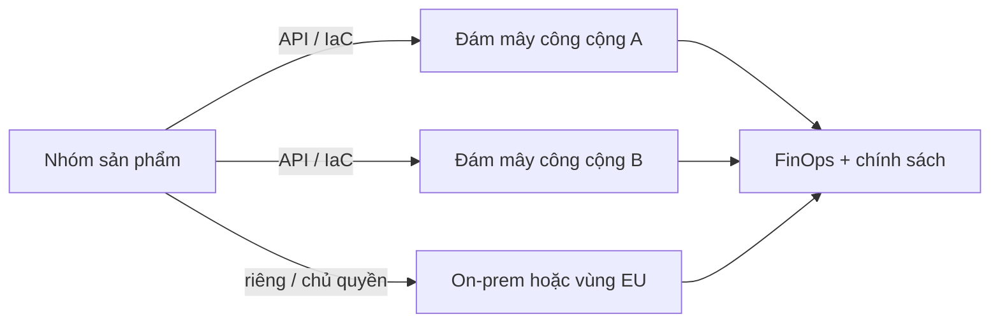

Bài tùy chọn này **không** thay các đặc trưng NIST, mô hình dịch vụ hay mô hình triển khai trong phần bắt buộc. Nó cho thấy các ý tưởng đó xuất hiện thế nào trên hệ thống thật khoảng 2022–2026: đa đám mây, FinOps như *measured service*, ràng buộc đám mây chủ quyền, và phục vụ AI như một khối lượng công việc đám mây hạng nhất.

## Mục tiêu học tập

- Ánh xạ *rapid elasticity* và *measured service* của NIST sang thực hành FinOps và lập kế hoạch dung lượng AI.
- Phân biệt *đa đám mây tình cờ* với *đa đám mây có chủ đích* (cư trú dữ liệu, dịch vụ tốt nhất từng việc, lối thoát).
- Phác thảo đường phục vụ AI vẫn tôn trọng ranh giới IaaS/PaaS/SaaS.

## 1. Đa đám mây là trạng thái ổn định, không phải khẩu hiệu

Báo cáo *2025 State of the Cloud* của Flexera (ấn bản 14; hơn 750 người làm nghề) cho thấy **70%** tổ chức chạy hỗn hợp lai (ít nhất một đám mây công cộng và một đám mây riêng), và điển hình dùng khoảng **2,4 nhà cung cấp công cộng**. Quản lý chi phí là thách thức hàng đầu với **84%** người trả lời; nhóm FinOps đảm nhận một phần hoặc toàn bộ tối ưu chi phí tăng từ **51% lên 59%**. Tăng trưởng chi tiêu kỳ vọng (~28%) và lãng phí IaaS/PaaS ước tính (~27%) đi cùng tỷ lệ hồi hương khối lượng công việc khiêm tốn (~21%), nên dấu chân đám mây ròng vẫn tăng.

Đó là mô hình NIST khi bị tải thật: **gom nhóm tài nguyên** xuyên nhà cung cấp, **tự phục vụ theo nhu cầu** qua API, và **dịch vụ đo lường được** mà tài chính không còn coi là sai số làm tròn.



**Câu hỏi thiết kế.** Nếu dịch vụ chỉ chạy được trên API độc quyền của một nhà cung cấp, bạn có *mô hình triển khai* (đám mây công cộng) chứ chưa có kiến trúc *di động*. Tính di động là yêu cầu sản phẩm, không phải mặc định.

## 2. FinOps là measured service có vòng phản hồi

NIST *measured service* dừng ở đo lường. FinOps thêm phân bổ, dự báo và kinh tế đơn vị (chi phí mỗi đơn hàng, mỗi lần suy luận, mỗi tenant). Vòng tối thiểu:

1. **Gắn thẻ và phân bổ** mọi tài nguyên tính tiền (nhóm, môi trường, sản phẩm).
2. **Đặt chi phí đơn vị** cạnh SLO (độ trễ p99, tỷ lệ lỗi), không chỉ cạnh hóa đơn.
3. **Hành động**: chỉnh kích thước, mix reserved/spot, scale-to-zero, hoặc *hồi hương* khi kinh tế đảo chiều.

Phác thảo Python cho kiểm tra chi phí đơn vị từ bản xuất hóa đơn:

```python
def unit_cost(invoice_usd: float, successful_inferences: int) -> float:
    if successful_inferences <= 0:
        raise ValueError("không có việc thành công để phân bổ chi phí")
    return invoice_usd / successful_inferences

gpu_unit = unit_cost(18_400.0, successful_inferences=2_100_000)
api_unit = unit_cost(9_250.0, successful_inferences=2_100_000)
print(f"GPU ${gpu_unit:.4f}  vs  API ${api_unit:.4f} mỗi lần suy luận")
```

Con số không phải chiến lược. Chiến lược là làm **đàn hồi nhìn thấy được** để nhóm không biến đám mây thành CapEx vô hạn.

## 3. Phục vụ AI như một mẫu ứng dụng đám mây

AI tạo sinh không invent đặc trưng NIST mới; nó làm chúng căng. Một stack phục vụ điển hình 2024–2026:

| Lớp | Vai trò | Ánh xạ đám mây |
| --- | --- | --- |
| Client / BFF | Auth, hạn mức, chính sách prompt | SaaS hoặc PaaS tự xây |
| Bộ định tuyến suy luận | Phiên bản mô hình, A/B, cache | PaaS / service mesh |
| Engine (ví dụ vLLM) | Decode GPU theo lô | IaaS + SKU GPU |
| Điều phối (KServe, Ray Serve) | Scale, canary, giao thức | Kubernetes / PaaS |

KServe (CNCF incubating cuối 2025) coi `InferenceService` là tài nguyên Kubernetes với scale-to-zero và chia lưu lượng canary. Ray Serve ghép đồ thị Python (truy xuất → xếp hạng lại → sinh) trên KubeRay. Cả hai thường bọc **vLLM** cho HTTP tương thích OpenAI. Sinh viên cần thấy bước SOA: *mô hình* là dịch vụ có phiên bản và SLA, không phải artifact notebook.

<div class="content-box warning-box">
<p><strong>Cold start và chi phí GPU.</strong> Scale-to-zero đẹp trên giấy và đắt ở đuôi độ trễ LLM. Nhóm production thường đặt <code>minReplicas: 1</code> và mua đàn hồi trên trục replica, không phải trục zero.</p>
</div>

## 4. Chủ quyền và tuân thủ định hình lại mô hình triển khai

Public / private / hybrid / community vẫn đúng, nhưng *byte nằm ở đâu* đang dẫn dắt kiến trúc. Quy tắc bảo vệ dữ liệu EU và hợp đồng khách hàng đẩy **vùng chủ quyền**, khóa do khách quản lý, và thiết kế “dữ liệu không rời VPC này”. Hybrid không còn chỉ là “di sản dưới tầng hầm”: thường là mặt phẳng *tuân thủ* cạnh mặt phẳng *hàng hóa* công cộng.

## Thách thức

- **Đa đám mây tình cờ**: hai nhà cung cấp vì hai nhóm chọn mặc định, không có hợp đồng định danh, mạng hay dữ liệu giữa chúng.
- **Sốc hóa đơn AI**: token và giờ GPU khó dự báo hơn giờ VM.
- **Tách kỹ năng**: FinOps, nền tảng và phục vụ ML nói các SLO khác nhau.

## Bài tập

1. Lấy một ví dụ bài bắt buộc (ví dụ burste thương mại điện tử). Thêm nhà cung cấp thứ hai *chỉ* cho object storage. Liệt kê chi phí định danh, độ trễ và egress vừa chấp nhận.
2. Dùng trang giá công khai, ước lượng chi phí tháng cho 10 triệu lời gọi LLM ngắn trên API quản lý so với một GPU reserved. Nêu giả định.
3. Viết chính sách cư trú dữ liệu sáu dòng: log, embedding và prompt nào được rời Việt Nam / EU, cái nào không.

## Tài liệu tham khảo

1. Flexera, *2025 State of the Cloud Report* (tháng 3/2025). [Tóm tắt báo chí](https://www.flexera.com/about-us/press-center/new-flexera-report-finds-84-percent-of-organizations-struggle-to-manage-cloud-spend); [xu hướng](https://www.flexera.com/blog/finops/the-latest-cloud-computing-trends-flexera-2025-state-of-the-cloud-report/).
2. Flexera, PDF đầy đủ: [Flexera-State-of-the-Cloud-Report-2025.pdf](https://resources.flexera.com/web/pdf/Flexera-State-of-the-Cloud-Report-2025.pdf).
3. CNCF / Linux Foundation Research, *Cloud Native 2024 Annual Survey* (1/4/2025): [trang báo cáo](https://www.cncf.io/reports/cncf-annual-survey-2024/).
4. NIST SP 800-145 — đường cơ sở các bài bắt buộc mà ứng dụng này vẫn hiện thực hóa.
5. Tài liệu vLLM và KServe `InferenceService` (CNCF; incubating công bố 11/2025).
