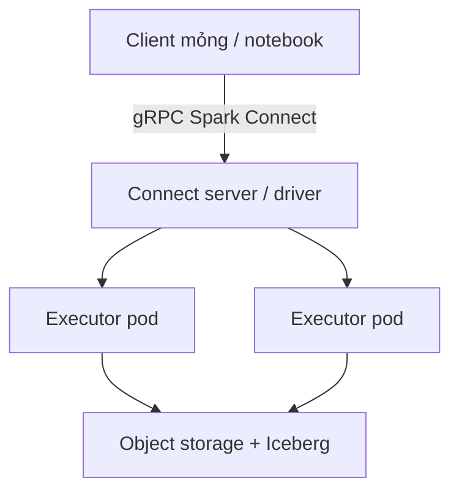

Bài bắt buộc phủ driver, executor, RDD và cluster manager (kể cả Kubernetes). Ghi chú tùy chọn tập trung vào **ứng dụng coi Spark là dịch vụ từ xa**: Spark Connect (từ 3.4) và câu chuyện client/server của **Spark 4.0.0** (23/5/2025) — cùng lý do nhiều nhóm 2022–2026 chạy Spark trên Kubernetes thay vì cụm YARN đứng sẵn.

> Lý thuyết bắt buộc đang ở bản tiếng Anh. Đây là phần ứng dụng tùy chọn bằng tiếng Việt.

## Mục tiêu học tập

- Giải thích Spark Connect như sự tách gRPC giữa *tiến trình người dùng* và *session cụm*.
- Liệt kê điều Spark 4.0 thêm cho client Connect (Python client nhẹ, `spark.api.mode`, ML trên Connect).
- Quyết định khi nào API thời RDD chặn việc chuyển sang Connect.

## 1. Vì sao driver nặng trở thành vấn đề

Spark cổ điển nhúng tiến trình JVM/Python của người dùng vào đường điều khiển cụm. Điều đó khó cho:

- Ứng dụng dữ liệu đa thuê bao và IDE không nên ship PySpark 200 MB.
- Notebook từ xa không được chết khi driver bị preempt.
- Client ngôn ngữ không lấy JVM làm trung tâm.

Spark Connect gửi **logical plan chưa resolve** qua gRPC. Server sở hữu Catalyst/Tungsten; client là stub. Tài liệu chính thức: RDD và `SparkContext` **không** nằm trên đường Connect — DataFrame/SQL mới có.

```python
from pyspark.sql import SparkSession

spark = (
    SparkSession.builder
    .config("spark.api.mode", "connect")
    .remote("sc://spark-connect-server:15002")
    .getOrCreate()
)

df = spark.read.parquet("s3a://lab/events/")
df.groupBy("country").count().show()
```

Điểm nhấn Spark 4.0 (ghi chú phát hành): **`pyspark-client` ~1,5 MB**, tarball thêm với Connect bật sẵn, tương thích API client Java, ML trên Connect, và client mới (kể cả Swift). Databricks Runtime 17.0 ship Spark 4.0 cho sinh viên chỉ có playground quản lý.

## 2. Spark trên Kubernetes như nền tảng ứng dụng

Nhóm nền tảng 2022–2026 thường nộp Spark dưới dạng **Pod**:

- Một bộ driver + executor cô lập mỗi job (hoặc Deployment Connect sống lâu).
- Node selector cho spot vs on-demand, GPU cho pandas UDF / Torch.
- Cùng stack quan sát (OTel, Prometheus) với microservice.

Đây là kiến trúc bắt buộc (driver/executor) với **cluster manager** khác. Shuffle service và cấp phát động cần thêm ống Kubernetes; đó là mối quan tâm *ứng dụng* nay, không chỉ của quản trị Hadoop.



## 3. Mẫu ứng dụng

1. **Phân tích tương tác** — nhiều người dùng, một endpoint Connect, bảo mật mức hàng ở server.
2. **Đặc trưng theo lịch** — `CronJob` Kubernetes hoặc Airflow chỉ cần client mỏng trong CI.
3. **Spark nhúng** — microservice Go/Python nhờ Spark join 2 TB rồi trả kết quả nhỏ (SOA: Spark là *phụ thuộc*, không phải cả ứng dụng).

<div class="content-box warning-box">
<p><strong>Bài tập RDD và Connect.</strong> Nếu lab vẫn yêu cầu <code>sc.parallelize</code> và partition tường minh, bạn đang trên Spark Classic. Điều đó ổn để dạy lineage; đừng giả vờ đó là mặc định ứng dụng 2025.</p>
</div>

## Thách thức

- Hố API Connect (đặc biệt mã RDD/ML cũ).
- Connect server dùng chung là **hàng xóm ồn** và biên bảo mật.
- Shuffle/ổ cục bộ Kubernetes dễ sai hơn locality HDFS.

## Bài tập

1. Từ ghi chú Spark 4.0, liệt kê ba mục Connect giúp nhóm *không-JVM*.
2. Vẽ Catalyst chạy ở đâu trong Classic vs Connect.
3. Đề xuất thiết kế namespace/hạn mức để job sinh viên không làm đói Deployment Connect dùng chung.

## Tài liệu tham khảo

1. Apache Spark, *Spark Release 4.0.0* (23/5/2025).
2. Apache Spark, *Spark Connect*: [spark.apache.org/spark-connect](https://spark.apache.org/spark-connect/).
3. Tài liệu Spark 4.0.0, *Spark Connect Overview*.
4. Blog Databricks, “Introducing Apache Spark 4.0”.
5. Apache Spark, *Running Spark on Kubernetes*.
