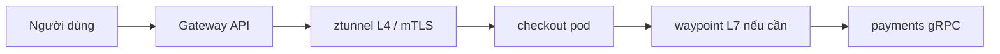

Chương bắt buộc giải thích Pod, Service và Deployment. Bài tùy chọn này là lớp *mạng ứng dụng* 2022–2026 phía trên: **Gateway API** (GA 10/2023; mesh + GRPCRoute ở v1.1, 5/2024), **Istio ambient** (GA trong Istio 1.24), và data plane **eBPF** (Cilium). Khảo sát CNCF 2024 quan trọng: Kubernetes phổ biến (**80%** production), nhưng **dùng service mesh trên production giảm từ 50% xuống 42%** — độ phức tạp là chủ đề hạng nhất, không phải chú thích.

> Lý thuyết bắt buộc đang ở bản tiếng Anh. Đây là phần ứng dụng tùy chọn bằng tiếng Việt.

## Mục tiêu học tập

- Thay “Ingress mãi mãi” bằng Gateway / HTTPRoute / GRPCRoute như hợp đồng bắc–nam.
- Đối chiếu mesh sidecar với ambient (ztunnel + waypoint tùy chọn).
- Quyết định khi nào chính sách CNI eBPF đủ và khi nào vẫn cần chính sách L7 mesh.

## 1. Gateway API như biên SOA di động

Gateway API v1.0 (31/10/2023) tốt nghiệp `Gateway`, `GatewayClass` và `HTTPRoute`. v1.1 (9/5/2024) đưa **dùng cho service mesh** (HTTPRoute `parentRef` tới Service) và **GRPCRoute** vào kênh Standard. Một đối tượng route mô tả cả ý định ingress và đông–tây.

```yaml
apiVersion: gateway.networking.k8s.io/v1
kind: HTTPRoute
metadata:
  name: checkout
spec:
  parentRefs:
    - name: edge-gateway
  rules:
    - matches:
        - path: { type: PathPrefix, value: /checkout }
      backendRefs:
        - name: checkout
          port: 8080
```

Nhóm ứng dụng sở hữu *route*; nhóm nền tảng sở hữu *Gateway*. Sự tách đó là mô hình quản trị SOA mà Kubernetes thiếu khi mọi người chia một thổ ngữ annotation Ingress khổng lồ.

## 2. Ambient mesh: mTLS không thuế sidecar

Istio ambient (công bố 2022, **GA ở 1.24**, cuối 2024) đặt L4 vào **ztunnel** nút và L7 tùy chọn vào proxy **waypoint**. Mục tiêu: định danh mật mã và telemetry golden-signal *không* sidecar trong mọi Pod (lời phàn nàn vận hành phía sau mức adoption CNCF giảm).

Cilium (cũng CNCF graduated) hiện thực nhiều L3/L4 trong **eBPF** và có thể thêm L7 qua Envoy. So sánh Istio 2024 ghi hai dự án thường **kết hợp**: Cilium cho CNI/NetworkPolicy, Istio cho L7 và định danh. Sinh viên không nên coi chúng là thương hiệu loại trừ lẫn nhau.



## 3. Khi *không* thêm mesh

Thêm mesh khi cần **định danh di động** (SPIFFE), timeout nhất quán, hoặc authz L7 xuyên ngôn ngữ. Bỏ qua khi bạn có ba dịch vụ và một Ingress — mức giảm 50%→42% của CNCF là cảnh báo, không phải thất bại của ý tưởng.

<div class="content-box warning-box">
<p><strong>Mesh không phải quan sát.</strong> Bạn vẫn cần OpenTelemetry trong ứng dụng cho span nghiệp vụ. Data plane cho golden signal; nó không biết <code>order.id</code>.</p>
</div>

## Thách thức

- Hai API lưu lượng trong một cụm (Ingress cũ + Gateway + VirtualService).
- Ambient + CNI thay kube-proxy cần cờ đã tài liệu hóa để socket load-balancing không bỏ qua mesh.
- Hỗ trợ GRPCRoute chậm hơn HTTPRoute ở một số implementation — kiểm tra ma trận controller.

## Bài tập

1. Viết lại YAML Ingress đơn giản thành Gateway + HTTPRoute. Ai sở hữu từng đối tượng?
2. Với API thanh toán gRPC, lập luận cho GRPCRoute vs. HTTP/JSON ở biên.
3. Dùng số CNCF 2024, viết một đoạn khuyến nghị cho văn phòng khoa: mesh hay không cho hệ thống campus 15 dịch vụ.

## Tài liệu tham khảo

1. Blog Kubernetes, “Gateway API v1.0: GA Release” (31/10/2023).
2. Blog Kubernetes, “Gateway API v1.1” (9/5/2024).
3. Istio, “Ambient Mode Reaches General Availability in v1.24”.
4. Istio, “Istio Ambient vs. Cilium” (2024).
5. CNCF *Cloud Native 2024 Annual Survey* (80% K8s; mesh 42%).
