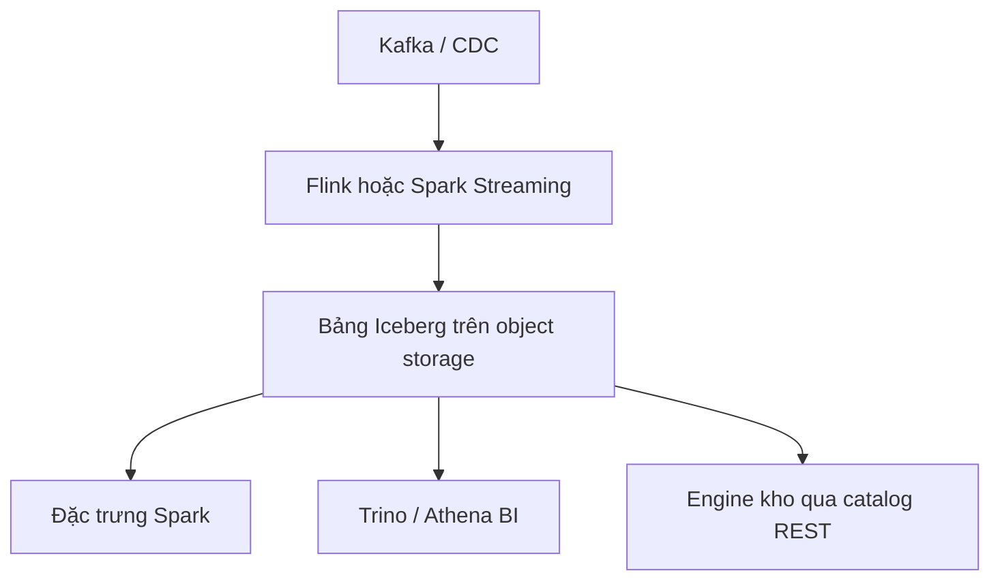

Chương bắt buộc định nghĩa nền tảng, pipeline và xử lý Lambda/Kappa. Bài tùy chọn này là ứng dụng **lakehouse mở** 2022–2026: một bản sao dữ liệu trên object storage, metadata bảng **Iceberg/Delta/Hudi**, và nhiều engine (Spark, Flink, Trino, kho SaaS) chia **catalog REST**.

> Lý thuyết bắt buộc đang ở bản tiếng Anh. Đây là phần ứng dụng tùy chọn bằng tiếng Việt.

## Mục tiêu học tập

- Giải thích “ghi một lần, đọc ở nhiều engine” như kiến trúc nền tảng, không phải trivia định dạng tệp.
- Đặt catalog REST Apache Polaris / Iceberg vào củ hành ingestion–lưu trữ–xử lý–truy vấn.
- Đối chiếu lô/luồng lakehouse với nền tảng chỉ-kho độc quyền.

## 1. Hợp đồng nền tảng chuyển sang bảng

Hợp đồng nền tảng Hadoop 2015 là “HDFS + Hive Metastore + YARN.” Hợp đồng 2025 gần hơn với:

1. **Object storage** (S3/GCS/ADLS) như lớp bền.
2. **Định dạng bảng mở** (Iceberg, Delta Lake, Hudi) cho snapshot, tiến hóa lược đồ và xóa.
3. **Catalog** hiện thực spec REST Iceberg để Spark, Trino và Flink thấy cùng bảng.
4. **Engine** đổi được mà không copy petabyte.

Snowflake đóng góp **Polaris** (catalog REST Iceberg) cho ASF năm 2024. Databricks mua Tabular (người tạo Iceberg) năm 2024 và ship **Delta UniForm** để bảng Delta trình bày metadata Iceberg. Bài kỹ thuật Capital One 2025 gọi đây là *hội tụ định dạng*: kiến trúc sư nên giả định đọc đa engine.

Khảo sát hệ sinh thái Iceberg 2025 (kết quả 2026) ghi Iceberg là định dạng mở được nêu độc quyền nhiều nhất trong *mẫu đó*, catalog vẫn phân mảnh (Glue, Nessie, S3 Tables, Polaris, …). Dùng khảo sát như **hướng**, không phải một số thị phần.

## 2. Ứng dụng: phân tích đa đám mây không ETL thứ hai



*Ứng dụng* là mart phân tích sản phẩm, không phải thương hiệu SQL. Quản trị (ai được `DELETE` snapshot, vùng nào giữ PII) sống ở catalog + IAM, khớp phần quản trị dữ liệu của bài bắt buộc.

```sql
SELECT country, count(*) AS n
FROM lake.events
WHERE event_date BETWEEN DATE '2026-09-01' AND DATE '2026-09-07'
GROUP BY 1;
```

## 3. Streaming + lô trên một bảng (Kappa có cửa thoát)

Kappa nói “luồng là nguồn sự thật.” Thực hành lakehouse: luồng **append** + lô **nén/viết lại** + time-travel để kiểm toán. Vẫn là nền tảng (ingestion, lưu trữ, xử lý, truy vấn) — củ hành của bài bắt buộc — với tính nguyên tử tốt hơn thư mục `/events/2026/09/16/` thô.

<div class="content-box insight-box">
<p><strong>Dữ liệu như sản phẩm.</strong> Bảng Iceberg có chủ, SLO và nhật ký đổi lược đồ gần với <em>dịch vụ</em> SOA hơn thư mục dump. Catalog là registry.</p>
</div>

## Thách thức

- Phân mảnh catalog (hai catalog REST là hai nguồn sự thật).
- Tệp nhỏ và ingest streaming không có job rewrite theo lịch.
- *Egress* xuyên đám mây khi bảng “mở” nằm trong bucket một hyperscaler.

## Bài tập

1. Ánh xạ Hive Metastore + HDFS sang Iceberg REST + object storage. Chế độ lỗi nào còn nguyên?
2. Thiết kế bảng PII: snapshot nào được rời vùng VN/EU, engine nào được đọc?
3. Vì sao một nhóm giữ Flink cho ingest và Spark cho backfill trên *cùng* bảng Iceberg?

## Tài liệu tham khảo

1. Apache Iceberg: [iceberg.apache.org](https://iceberg.apache.org/).
2. Databricks, “Delta UniForm”.
3. Capital One Tech, “Lakehouse Convergence: Delta Lake & Iceberg” (2025).
4. Data Lakehouse Hub, kết quả khảo sát Iceberg 2025 (2/2026).
5. Tài liệu sink Apache Flink + Iceberg (mẫu ingest streaming).
