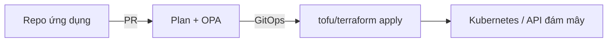

Bài bắt buộc giới thiệu IaC khai báo, resource/state Terraform, và Ansible. Ghi chú tùy chọn phủ **tách giấy phép tháng 8/2023** (Terraform BSL vs **OpenTofu** MPL 2.0 dưới Linux Foundation), **chính sách dưới dạng mã** trên đường plan, và platform engineering (module vàng) như ứng dụng IaC trong 2024–2026.

> Lý thuyết bắt buộc đang ở bản tiếng Anh. Đây là phần ứng dụng tùy chọn bằng tiếng Việt.

## Mục tiêu học tập

- Nêu điều đổi ngày 10/8/2023 và vì sao OpenTofu 1.6 (1/2024) tồn tại.
- Thêm chính sách kiểu OPA/Conftest để `apply` không tạo bucket công cộng tình cờ.
- Mô tả registry module của nhóm nền tảng như SOA nội bộ.

## 1. Hai CLI, một thói quen HCL

HashiCorp chuyển Terraform 1.6+ sang **Business Source License 1.1** (không được OSI phê duyệt). Liên minh nhà cung cấp fork 1.5.x → tuyên ngôn OpenTF → **OpenTofu** tại Linux Foundation (gia nhập 9/2023; **1.6.0 ổn định 10/1/2024**). Hàng ngày, `tofu` phần lớn thay thế được HCL và provider hiện có. Phân kỳ sau đó gồm tính năng như mã hóa state native trong OpenTofu. IBM mua HashiCorp (2024–2025) thuộc câu chuyện quản trị sinh viên cần gọi tên được.

**Lập trường khóa học:** học *ý tưởng* (state, plan, provider). Trong lab, CLI nào cũng được; trong ngành, pháp chế có thể chọn một.

```hcl
resource "aws_s3_bucket" "raw" {
  bucket = "iuh-lab-raw-${var.env}"
}
```

## 2. Chính sách dưới dạng mã: admission controller cho hạ tầng

IaC khai báo không tự động *an toàn*. Engine chính sách (Open Policy Agent, Sentinel, Checkov) đánh giá **JSON plan** trước apply.

```rego
package terraform.s3

deny[msg] {
  some rc
  rc := input.resource_changes[_]
  rc.type == "aws_s3_bucket_public_access_block"
  rc.change.after.block_public_acls == false
  msg := sprintf("%s cho phép ACL công cộng", [rc.address])
}
```

Đây là cùng sự tách *control vs data plane* như admission Kubernetes: lập trình viên khai báo ý định; nền tảng thực thi cư trú, thẻ (FinOps) và mã hóa.

## 3. Platform engineering: IaC như sản phẩm nội bộ

Đến 2024, nhiều tổ chức ngừng đưa mỗi nhóm một tài khoản đám mây thô. **Nhóm nền tảng** công bố:

- Module có phiên bản (`eks-cluster/v4`, `postgres/v2`).
- Đường trải nhựa (Backstage + GitOps + OPA).
- SLO cho “thời gian tới môi trường preview mới.”

Khảo sát CNCF 2024 nhấn mạnh tăng CI/CD và GitOps; IaC là *định nghĩa*, Git là *vận chuyển*, cụm (Chương 09) là *runtime*. Đa đám mây (Chương 12) xuất hiện như hai provider sau một giao diện module — không phải hai bản sao mọi repo.



<div class="content-box insight-box">
<p><strong>State vẫn là phần khó.</strong> Dù tệp được OpenTofu mã hóa hay lưu trên HCP Terraform, cảnh báo bài bắt buộc vẫn đứng: hai writer, một state, split-brain.</p>
</div>

## Thách thức

- Nhân bản provider/registry và lockfile giữa các fork.
- Ghim phiên bản module vs. vá bảo mật “luôn latest.”
- Gói chính sách từ chối mọi lab sinh viên tình cờ.

## Bài tập

1. Viết chính sách: mọi resource phải có `tags.owner` và `tags.cost_center`.
2. Một đoạn văn: trường hợp BSL vs MPL quan trọng với *nhà cung cấp* xây SaaS quanh IaC, vs. sinh viên apply một VM.
3. Thiết kế API module vàng cho “môi trường preview sinh viên” (input, output, trần chi phí).

## Tài liệu tham khảo

1. Dự án OpenTofu: [opentofu.org](https://opentofu.org/).
2. Thông báo BSL của HashiCorp (10/8/2023) và ghi chú OpenTofu 1.6.0 (10/1/2024).
3. Open Policy Agent: [openpolicyagent.org](https://www.openpolicyagent.org/).
4. CNCF *Cloud Native 2024 Annual Survey* (CI/CD, GitOps).
5. Bài Terraform bắt buộc — provider, resource, state — vẫn là tiên quyết.
